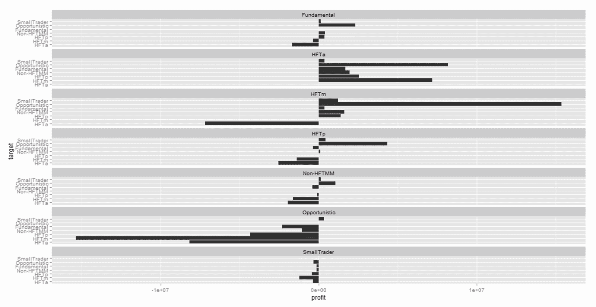
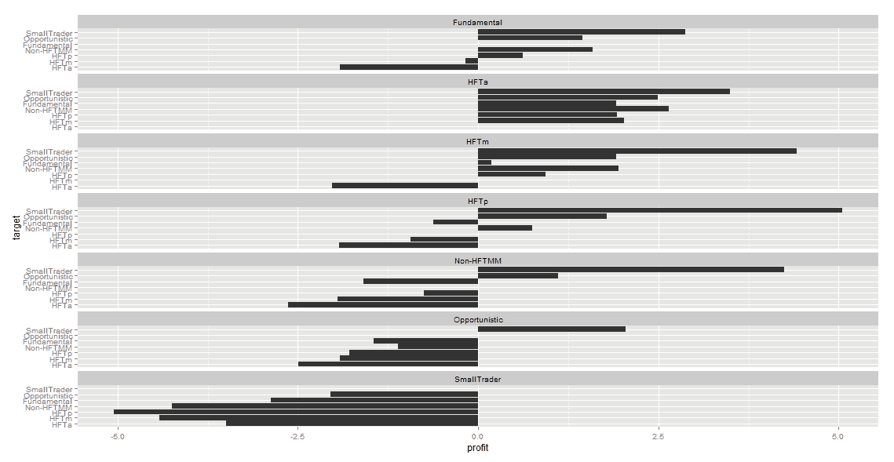

<!--yml

分类：未分类

日期：2024-05-18 14:53:44

-->

# 及时投资组合：高频 | 获胜者和失败者之间的和弦

> 来源：[`timelyportfolio.blogspot.com/2014/05/high-frequency-winners-and-losers-by.html#0001-01-01`](http://timelyportfolio.blogspot.com/2014/05/high-frequency-winners-and-losers-by.html#0001-01-01)

我承认，看起来我是世界上唯一一个没有读过迈克尔·刘易斯《闪购男孩》的人。

与《闪购男孩》相比，我对这篇优秀的论文的关注稍微少了一些。

> 巴伦，马修，布罗加德，乔纳森，基里连科，安德烈·A.
> 
> **高频交易中的风险与回报** 2014 年 5 月 5 日
> 
> 在 SSRN 上提供：[`ssrn.com/abstract=2433118`](http://ssrn.com/abstract=2433118)

该论文为 E-mini S&P 500 期货合约中的玩家及其影响提供了令人难以置信的视角。数据如此之好，我不得不从他们的表格中解锁数据。我最喜欢的表格是第 7 张，其中包含了 2010 年 8 月不同交易者类型之间的平均每日短期利润分解。利润被给出为平均每日美元利润和每份合约的利润。 [d3 和弦布局](https://github.com/mbostock/d3/wiki/Chord-Layout)似乎完美地可视化这些数据。幸运的是，本·亨特刚刚在博客上介绍了他在[和弦图中的 rCharts](http://mostlyconjecture.com/2014/05/03/chord-diagrams-with-rcharts/)中定制的和弦布局。以美丽的开源方式，我能够适应它，并迅速查看数据如下。我不确定它如何与《闪购男孩》联系在一起，但我想这为故事增添了一些可信度。只要看看“小型交易者”的悲惨损失就知道了。

作为交互式和静态图表之间的比较，我将会添加一些 ggplot2 版本。我必须承认，我在上面的图表或下面的图表上花的时间很少进行定制。我稍后再做。

(https://blogger.googleusercontent.com/img/b/R29vZ2xl/AVvXsEgwA-tbyxRWhbjFsHuR0uJLS6nb3G6NuxrY690Xt5fDeOAzoot9J1Zdsduii4yGSDOfAtDfdhI39u-yOID70KeOCWzQbQIF47YCm9ERKEAIlf-FgNZ2NVibW4UesLIBU6GcOIPn00xSoQ/s1600-h/image%25255B4%25255D.png)

(https://blogger.googleusercontent.com/img/b/R29vZ2xl/AVvXsEhiaYxNch3lUOfO_l7vto3yKtRZ5chWDWdmYLLpRaGHhkaFz2Ehyl3gud35JDDHpO4RzRUUp3r_w1qrShdOd20UCl__9K2bjljvE9b3F6jE3ov4TpeW7s0jBcPeesm405M2SkoZcD3M2A/s1600-h/image%25255B9%25255D.png)

源代码在 Github 上：[https://github.com/timelyportfolio/rCharts
