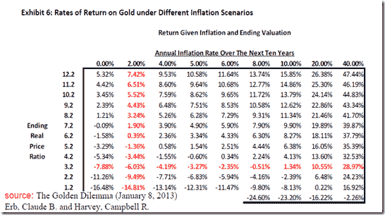
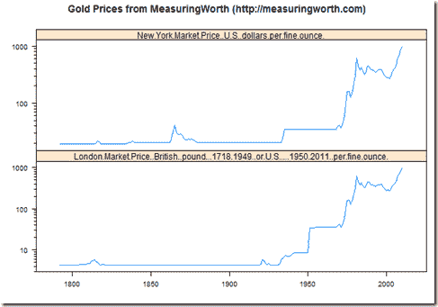

<!--yml

分类：未分类

日期：2024-05-18 15:01:01

-->

# 及时投资组合：我是如何错过“黄金困境”的？

> 来源：[`timelyportfolio.blogspot.com/2013/03/how-did-i-miss-golden-dilemma.html#0001-01-01`](http://timelyportfolio.blogspot.com/2013/03/how-did-i-miss-golden-dilemma.html#0001-01-01)

我羞于承认，在发现这篇优秀的论文方面，我落后了很远（大约有 10,127 次下载）：“及时投资组合：我是如何错过‘黄金困境’的？”

> **黄金困境**（2013 年 1 月 8 日）
> 
> 厄布，克劳德·B. 和 哈维，坎贝尔·R.
> 
> 在 SSRN 上可获得：[`ssrn.com/abstract=2078535`](http://ssrn.com/abstract=2078535)
> 
> 

以下是作者们在 2012 年 7 月介绍这个概念的幻灯片，如果你更喜欢幻灯片格式（感谢[`abnormalreturns.com/saturday-links-the-gold-dilemma/`](http://abnormalreturns.com/saturday-links-the-gold-dilemma/ "http://abnormalreturns.com/saturday-links-the-gold-dilemma/”)）。

> 关于“黄金困境”的演讲，由**克劳德·厄布**和**坎贝尔·哈维**所作。([杜克大学](http://faculty.fuqua.duke.edu/~charvey/Gold.pdf))

我一直在挣扎于听到持有黄金的各种理由，这些理由经常相互冲突，并且黄金不能在所有环境中都普遍起作用。作者们列举并探讨了持有黄金的 6 个理由：

1.  “黄金提供了通胀对冲”

1.  “黄金作为一种货币对冲工具”

1.  “黄金是低实际回报资产的有吸引力的替代品”

1.  “黄金在压力时期是一个安全的避风港”

1.  “应该持有黄金，因为我们正在回归一个实际的黄金标准”

1.  “黄金的持有量不足”

在 2010 年和 2011 年的帖子中，我重点讨论了黄金作为一种非常昂贵的通胀对冲工具，但我在这方面远没有作者们那样详尽，并且没有触及其他五个方面。

我非常喜欢这篇论文中的图表 6，它概述了基于 10 年预期通胀率变化和黄金/消费者价格指数恒定的不同情景（自 1975 年以来平均为 3.2%，2012 年 3 月为 7.1%）。

尽管 1975-2012 年黄金/消费者价格指数比率平均为 3.2，但作者将分析扩展到 1791 年，使用在[MeasuringWorth](http://measuringworth.com/)收集的非常精细的数据（稍后在帖子中会更详细地介绍如何将此数据导入 R，供 R 极客们参考）。从 1791 年以来，黄金/消费者价格指数平均为 2，这明显低于当前的几乎 8。根据上述表格，除非未来十年的年化通胀率超过 15%，否则的名义回报将是负的。想想在这种环境下其他市场会发生什么，黄金可能还不是最糟糕的。

我也很高兴看到作者们反映了我担忧的观点 2 在贬值环境中可能很容易与观点 1 相同。

> “将黄金视为货币对冲的另一种方式是，将黄金视为在我自己的国家花费的货币的对冲，当当地政府不顾一切地印刷货币时。这种情况有时也被称为‘货币贬值’。如果这种贬值是通货膨胀的结果，那么这种解释就是‘黄金作为通胀对冲’论点的另一种版本。”

我强烈建议读者通过阅读原始论文与作者们一起探讨其他论点，但（剧透警告）如果你不想这么做，我认为结论非常简单，那就是在黄金价格大幅上涨之后，**六个论点**都无法证明当前的价格。 “黄金被低估”的论点是最强的，但即使如此，也需要一个独特的边际买家“[谁]不关注‘估值’。”当然，现在我们有很多中央银行买家，他们对每一种金融资产“不关注‘估值’。”

现在几乎是要介绍[R](http://r-project.org)了，但首先得谈谈[MeasuringWorth](http://measuringworth.com/)的数据，这 truly special，我会把它比作其他非常慷慨的金融数据集：[`mba.tuck.dartmouth.edu/pages/faculty/ken.french/data_library.html`](http://mba.tuck.dartmouth.edu/pages/faculty/ken.french/data_library.html)。尽管没有人要求我这样做，但请考虑通过[`www.measuringworth.com/contribute.php`](http://www.measuringworth.com/contribute.php "http://www.measuringworth.com/contribute.php") 捐款，以确保这些数据的持续性，也许还能收集更多数据。1900 年之前的非美国金融数据几乎找不到。

[MeasuringWorth](http://www.measuringworth.com/) 数据在 R 中非常容易获取。作为一个简单的例子，我想从 1700 年代以来引入黄金的价格。我在 2 行 R 代码中做到了这一点。在 5 行中我得到了这个图表。

(https://blogger.googleusercontent.com/img/b/R29vZ2xl/AVvXsEjgwxifxnMdb034jxnm1gLSpWDcxIWhkJzWrj8xsW-xnAasriHTiqZDsI25oDSec0uGGjR39557mB4zJXeImsqPwUfJ8TrVKt8cDcZJvbGN23ptT4wsxDX-tOY-z4UzXP0EGaRoZOsWVg/s1600-h/image%25255B39%25255D.png)

[R 代码来自 GIST:](https://gist.github.com/timelyportfolio/5172363)
