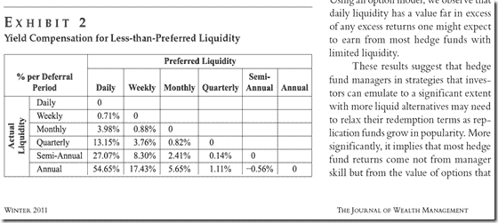
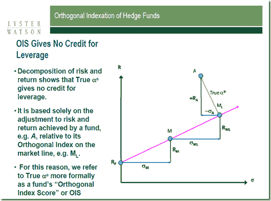

<!--yml

类别：未分类

日期：2024-05-18 15:01:56

-->

# 及时投资组合：范艾克追踪团队的一次有趣演讲

> 来源：[`timelyportfolio.blogspot.com/2013/01/interesting-presentation-from-van-eck.html#0001-01-01`](http://timelyportfolio.blogspot.com/2013/01/interesting-presentation-from-van-eck.html#0001-01-01)

我刚刚看了范艾克追踪团队在一次午餐会上做的非常有趣的演讲（[范艾克在 2012 年 7 月收购了这家公司](http://www.opalesque.com/industry-updates/2701/after-acquiring-hedge-fund-beta-business-and-team.html)），这是在阿拉巴马 CFA 协会的一次午餐会上。（点击这里查看他们的网站）我还没有机会阅读他们的所有研究，并尝试在 R 中复制部分内容，但我发现有两个观点非常有说服力。首先，对流动性价格的研究

> 弗里德，马克 S.，和本·麦克米伦。“可投资基准和私募基金流动性。”《财富管理杂志》14.3：58-66。[点击这里](http://www.iinews.com/site/pdfs/JWM_Winter2011_LysterWatson.pdf)查看全文

发布在**《财富管理杂志》**上，可能会从相反的角度回答沃伦·巴菲特关于“现金作为看涨期权”的观念，这篇文章描述了沃伦·巴菲特关于“现金作为看涨期权”的观点，以及我对这个话题的一些想法。[点击这里](http://timelyportfolio.blogspot.com/2012/11/cashopportunity-lost-or-opportunity.html)查看我的想法。下面展示了流动性的价格，

（[点击这里](http://www.iinews.com/site/pdfs/JWM_Winter2011_LysterWatson.pdf)查看图片）

因此，从流动性的角度来看，机会可能是巨大的。想象一下对冲基金的表现可能会是什么样子，扣除费用、税款和不流动性的影响。即使是最优秀的经理也无法实现足够高的回报来补偿这种内嵌成本的水平。奇怪的是，这也接近于我粗略的启发式方法，即为了证明不流动性的合理性，我需要 10%的预期回报溢价。

该演示文稿（[类似于费城 CFA 协会的演示文稿](http://www.cfasociety.org/pittsburgh/Linked%20Files/Dec_11_LW%20Investible%20Benchmarks%20and%20Hedge%20Fund%20Liquidity%20pdf.pdf)）也讨论了 True® Alpha 的概念。这个图表很好地描述了分解过程。

（[点击这里](https://blogger.googleusercontent.com/img/b/R29vZ2xl/AVvXsEjplGLP-dSnTu4Bj567QI4MCXWAFo1Fo_KjzyoySLSPRtPfaJj3SL6zQDcrPmeeA-d3WAPX0V7E4ZNVF_UWsKIMhV5-sIFDmCrtaawZbClUwAJnSeBU8A1PTHlFFvuI5Oe98tcgttSLIw/s1600-h/image%25255B13%25255D.png)查看图片）

我尚未与作者/演讲者确认他们是否使用了 R 语言，但他们的图表布局有些异常熟悉，这让我相信 R 在其中扮演了重要角色。无论如何，我真的很想用 R 重现一些计算。
