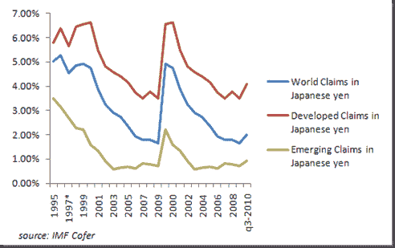
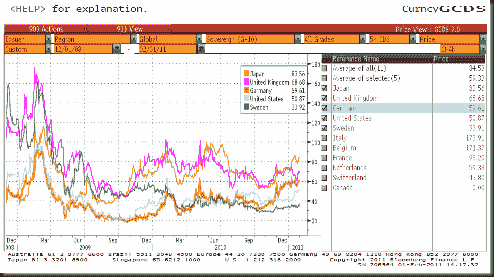
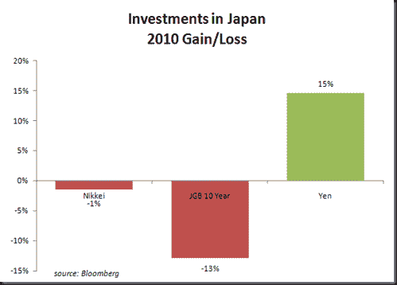

←yml

类别：未分类

日期：2024-05-18 15:23:28

→

# 及时投资组合：日元和 10 年期美国国债

> 来源：[`timelyportfolio.blogspot.com/2011/02/japanese-yen-and-us-treasuries.html#0001-01-01`](http://timelyportfolio.blogspot.com/2011/02/japanese-yen-and-us-treasuries.html#0001-01-01)

在下面的图表中，1993 年至 2008 年日元和 10 年期美国国债之间的密切关系是显而易见的。然而，自 2008 年金融危机以来，这些高度相关的工具已经相反移动。

通过[StockCharts.com](http://stockcharts.com/h-sc/ui?s=%24tnx&p=m&st=1992-01-01&en=(today)&id=p12823767116&a=223046980)

我正在努力理解这意味着什么，以及我可能如何从改变的关系中受益。我设想了一些原因，但我还是缺少了一些东西。到目前为止，我的列表：

> 1) 发展中国家已经多元化了其储备并购买了更多的日元，但这并没有在 IMF 储备上显示出来。
> 
> 
> 
> 2) 日元和国债现在都被视为“安全”和“无风险”的，因此它们被追求作为类似于黄金的保险。然而，这些只有在通货紧缩的环境中才能同时起作用。如果出现通货膨胀（我认为它在这里），但其他人明显不同意，日元和美国国债会受伤吗？
> 
> 
> 
> 信用违约市场显然不认为日元是无风险的，因为日本在其主权债务上承担更高的违约概率。
> 
> 
> 
> 3) 动量投资者正在购买日元，作为表现最佳的储备货币，仅仅是跟随趋势模型。然而，在数万亿美元的货币市场中，我不认为这种影响足够强大，以至于能强制这种不平衡。
> 
> 4) 也许日元是唯一在日本实际上上涨的东西，所以日元是日本人赚钱的地方。
> 
> 

看起来这些原因并不足以解释日元持续上涨的现象，所以我需要做更多的工作，更有创意地解决这个问题。如果你们有任何好的解释，请告诉我。

在进行过这样的思考训练后，我仍然认为情况很微妙，当然也找不到持有日元的好理由。

②5 小时
