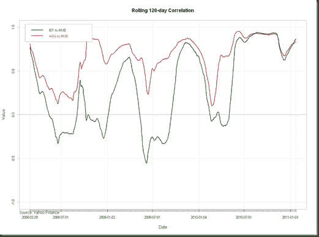

<!--yml

类别：未分类

日期：2024-05-18 15:24:11

-->

# 及时投资组合：不确定我理解市政债券的喧嚣

> 来源：[`timelyportfolio.blogspot.com/2011/01/not-sure-i-understand-fuss-about-munis.html#0001-01-01`](http://timelyportfolio.blogspot.com/2011/01/not-sure-i-understand-fuss-about-munis.html#0001-01-01)

最近，由于一种 perceived crisis，市政债券受到了很多媒体报道。然而，从 iShares 对[iShares S&P National AMT-free Municipal Bond Fund (MUB)](http://us.ishares.com/product_info/fund/overview/MUB.htm?fundSearch=true&qt=MUB)的描述来看，媒体和投资者似乎并不了解固定收益最重要的基本概念之一——久期。

> 截至 2011/1/24 的基本面
> 
> 加权平均到期日！加权平均到期日相比并没有那么奇怪或不寻常。到目前为止，它只是看起来是一个已经自我纠正的有限随机波动。

通过[StockCharts.com](http://stockcharts.com/h-sc/ui?s=mub:ief&p=d&yr=1&mn=0&dy=0&id=p26890504761&a=222442024)

当然，如果你有一个杠杆化的封闭式基金，痛苦会更糟，但那是杠杆的危险。

另一种统计方法是绘制滚动相关性（感谢 R 和 PerformanceAnalytics）。

](https://blogger.googleusercontent.com/img/b/R29vZ2xl/AVvXsEi0eCixpED1avl6WE2Ku00y4AdqRBkZLLSSA1hVcVUM9z06O-8fX8f_nMrF5lRiA-8dlKxFPx-IDFdZfXhd8XJRmGScmCaAdvQCUnSH3YDJchvPyIulPtC0s1msUMENk9VFWer6fFLJ5g/s1600-h/image12%5B1%5D.png)

这看起来并不奇怪或异常，特别是如果我们拿 2008 年的恐慌来比较。

这个故事的寓意是如果你投资债券，要关注期限。同样，投资级企业指数的期限也接近历史最高水平（LQD 为 7.01），所以那里也要非常小心。

*1.5 小时*
