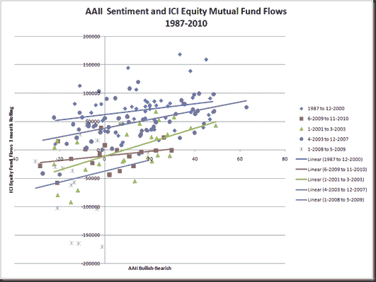

<!--yml

类别：未分类

日期：2024 年 05 月 18 日 15:27:12

-->

# Timely Portfolio：没有用资金支持的观点不太可信

> 来源：[`timelyportfolio.blogspot.com/2010/12/opinions-not-backed-with-money-are-not.html#0001-01-01`](http://timelyportfolio.blogspot.com/2010/12/opinions-not-backed-with-money-are-not.html#0001-01-01)

如果世界真的像一些人所说的那样对股票过于乐观，我认为资金会明显地流向那个方向。[Reuven Brenner](http://www.google.com/url?sa=t&source=web&cd=2&sqi=2&ved=0CCkQFjAB&url=http%3A%2F%2Fpeople.mcgill.ca%2Freuven.brenner%2F&ei=AtoDTdCzPIL68AaHkN3oAg&usg=AFQjCNEuEABpeGQTvMWHn65c3m2UEiNx7A&sig2=72tzgAtmCJeMjFpdsSwQWg "Reuven Brenner")在[赌博与投机](http://www.amazon.com/Gambling-Speculation-Theory-History-Decisions/dp/0521381800/ref=sr_1_6?ie=UTF8&qid=1292098820&sr=8-6 "http://www.amazon.com/Gambling-Speculation-Theory-History-Decisions/dp/0521381800/ref=sr_1_6?ie=UTF8&qid=1292098820&sr=8-6")中提供了一些赌博或冒险以改善财富的原因：娱乐、过度自信、在对概率进行了有能力的评估后的理性行为以及绝望或相对表现不佳。

在投资案例中，由于当赌注较低时，娱乐性可能会被消除。

但是，当前环境下，对风险的其他三种原因都会非常容易地适用于被认为是强劲看涨的市场情况。然而，对于我在媒体上惊讶地没有看到的一张图的分析显示了一个有趣的结果。由于金融危机的严重性而持续至今的，自 2007 年至 2008 年金融恐慌引发的资金外流，以及在所谓的“泡沫牛市”期间由 2009 年 3 月起的延续，由于危机的严重影响而导致的恐惧。当我们将 2009 年至今的时期与 1987 年（ICI 系列开始）至 2000 年和 2003 年至 2007 年最近的牛市进行比较时，股票型共同基金的资金流动状况显著不同，并且与经常被引用的[American Association of Individual Investors（AAII）](http://www.google.com/url?sa=t&source=web&cd=1&sqi=2&ved=0CBsQFjAA&url=http%3A%2F%2Faaii.com%2F&ei=BOIDTZq_H8OB8gbe36TrAg&usg=AFQjCNH43QiLqrZG9YBv_pvV1H-0qBeJoQ&sig2=Vdg0bSGYfr3vuS7SyBVw5w "AAII- The American Association of Individual Investors")的调查结果没有显示出任何真正的相关性。该调查显示出不同程度的看涨和看跌，但是观点并没有影响股票型共同基金的资金流出。无论看涨情绪是因为过度自信还是理性的概率评估，它都不足以说服投资者去追求提高财富的潜在机会。

(https://blogger.googleusercontent.com/img/b/R29vZ2xl/AVvXsEib8VsIARkg76TwBflGP7ILPJcDOqL9xt1f4TTBlL3pkeEf93OaiJJcX7OYzKOlBEHHV7C-T1XK16B8c6el6B689CbF58kV9d-QY91YEvF6cQX550cYZyXUkbvxbqVMeCCCalSdfUohOQ/s1600-h/image%5B6%5D.png)

如果这种由原因 2 和 3 结合第四个原因绝望所引发的看涨情绪还没有让资金流向机会，那么恐惧就会占上风。如果恐惧主导，那么机会就会被浪费，而美国不断加剧但已经创纪录的收入/财富不平等以及每个人储蓄大幅投资于债券的剧烈表现不佳将会引发更多的绝望。最终，如果出于某种原因 2 和 3 没有首先发挥作用，这种绝望将会变得如此严重，以至于迫使投资者承担风险。其确切表现尚不清楚，但它将出现在债券之外的地方。过度自信和绝望的风险承担会导致泡沫，但由于我们还没有看到任何真正的风险承担，目前股市中不存在泡沫。

1.5 小时
