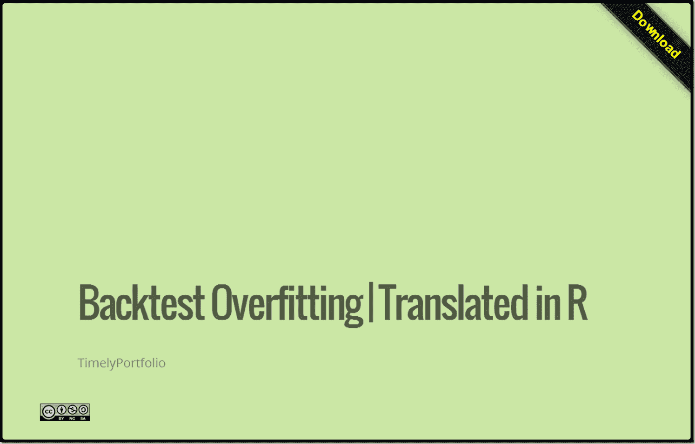

<!--yml

分类：未分类

日期：2024-05-18 14:56:47

-->

# 及时投资组合：过拟合回测

> 来源：[`timelyportfolio.blogspot.com/2013/10/overfitted-backtests.html#0001-01-01`](http://timelyportfolio.blogspot.com/2013/10/overfitted-backtests.html#0001-01-01)

自从我讨论过回测中的过拟合问题以来已经有一段时间了。[马科斯·洛佩斯·德·普拉多](http://www.quantresearch.info/index.html)及其合作者（[合作者列表](http://www.quantresearch.info/Co-authors.htm)）做了一些非常深思熟虑的工作（见底部），他们甚至开始了一个[博客](http://www.financial-math.org/blog/)。他们最新的论文建立在他们在早期工作中发现的发现之上，绝对是必读之作。

> 大卫·H·贝利（[链接](http://papers.ssrn.com/sol3/cf_dev/AbsByAuth.cfm?per_id=1787856)）、乔纳森·M·鲍威尔（[链接](http://papers.ssrn.com/sol3/cf_dev/AbsByAuth.cfm?per_id=2117800)）、马科斯·洛佩斯·德·普拉多（[链接](http://papers.ssrn.com/sol3/cf_dev/AbsByAuth.cfm?per_id=434076)）和朱奇·吉姆·支（[链接](http://papers.ssrn.com/sol3/cf_dev/AbsByAuth.cfm?per_id=779856)）
> 
> **伪数学与金融江湖骗子：回测过拟合对样本外表现的影响**（2013 年 10 月 7 日）
> 
> 可在 SSRN 上找到： [`ssrn.com/abstract=2308659`](http://ssrn.com/abstract=2308659)

将科学论文翻译成代码并不总是容易的，但我花了一些时间在 R 中实现了一些概念，以便我能更全面地理解这个东西。就像给其他人的一点鼓励一样，我不是数学天才，也没有接受过高级数学教育，所以请不要被公式吓倒。您将看到一个[slidify/rCharts 讨论](http://timelyportfolio.github.io/research_lopezdePrado)，展示了这些初步步骤。我计划对此进行更深入的研究。像往常一样，我写博客是为了互动，所以请告诉我您的想法。

（[链接](http://timelyportfolio.github.io/research_lopezdePrado)）
