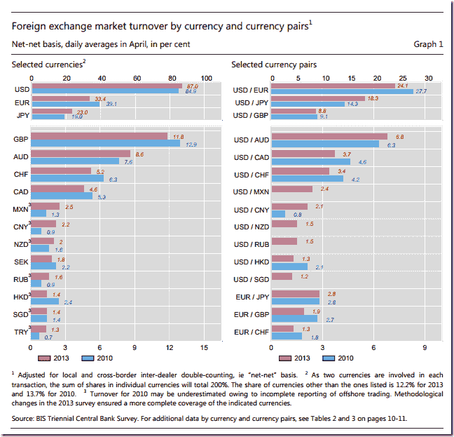
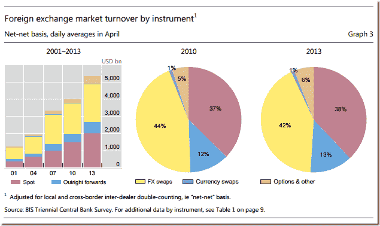

<!--yml

分类：未分类

日期：2024-05-18 14:53:36

-->

# 及时组合：PDF 图表–> Inkscape SVG –> d3 交互图表

> 来源：[`timelyportfolio.blogspot.com/2014/05/pdf-chart-inkscape-svg-d3-interactive.html#0001-01-01`](http://timelyportfolio.blogspot.com/2014/05/pdf-chart-inkscape-svg-d3-interactive.html#0001-01-01)

我刚刚花了几天的時間更新了自己对货币管理最新研究的了解。对于最佳实时（延迟约一年）的广泛视角，国际清算银行发布了一份极其有用的[三年一次的中央银行外汇调查](http://www.bis.org/publ/rpfx13.htm "http://www.bis.org/publ/rpfx13.htm")，在其中你可以看到这样的内容

](http://www.bis.org/publ/rpfx13fx.pdf)

以及这个。

](http://www.bis.org/publ/rpfx13fx.pdf)

PDF 文件缺乏交互性，所以我想到为什么不用[Inkscape](http://inkscape.org)的 PDF 到 SVG 转换来去除上述图表并将其转换为 SVG。然后，如果一切顺利，尝试使用[d3.js](http://d3js.org)提供的一些基本交互性。以下是发生的情况。

如果任何人想要一个关于这个过程更详细的说明，请告诉我。
