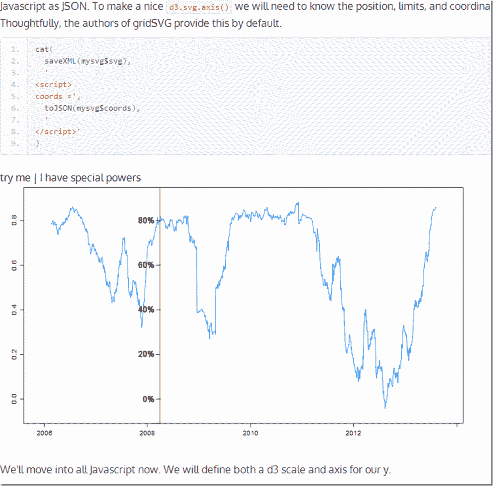

<!--yml

类别：未分类

日期：2024-05-18 14:58:13

-->

# 及时投资组合：PIMCO 滚动相关性，d3，R，gridSVG，格子 | 获得坐标轴

> 来源：[`timelyportfolio.blogspot.com/2013/08/pimco-rolling-correlation-d3-r-gridsvg.html#0001-01-01`](http://timelyportfolio.blogspot.com/2013/08/pimco-rolling-correlation-d3-r-gridsvg.html#0001-01-01)

你还能在别的地方听到 Pimco、滚动相关性、R、gridSVG、格子和 d3 全部在一个帖子里面吗？让我们把它们混合在一起看看可能会发生什么。对于那些喜欢技术的人来说，我们将为 y 轴添加一个 d3 坐标轴，并且它会跟随鼠标。对于那些不在乎 d3 和 R 的人来说，你也可能会喜欢这个图表，因为它绘制了 Pimco Total Return 和 Pimco All Asset Authority 之间的 90 天滚动相关性。点击[这里](http://timelyportfolio.github.io/gridSVG_d3_axis/)或者下面的屏幕截图，查看活页版本。

(http://timelyportfolio.github.io/gridSVG_d3_axis/)

某个时候我会找到我的创造力和知识的极限。请给我一些建议。
