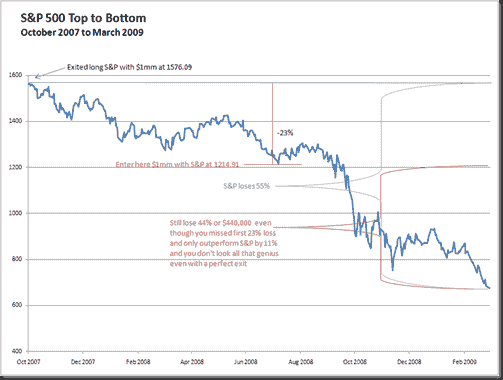

<!--yml

分类：未分类

日期：2024-05-18 15:24:43

-->

# 及时投资组合：底部挖掘的危险

> 来源：[`timelyportfolio.blogspot.com/2011/01/perils-of-bottom-picking.html#0001-01-01`](http://timelyportfolio.blogspot.com/2011/01/perils-of-bottom-picking.html#0001-01-01)

复利的负回报并不像[阿尔伯特·爱因斯坦（如果他真的说过的话）](http://www.snopes.com/quotes/einstein/interest.asp)所说的宇宙中最强大的力量——复利利息或正回报那样辉煌。跌幅是一系列陷阱或真正糟糕的负回报的复利。假设你作为大师投资者在 2007 年 10 月精确的高点 1576.09 处退出了你的 100 万美元的标普 500 头寸。你非常耐心地等待，并根据 1980-2006 年的投资经验，在七个月后的 1214.91 处重新进入，下跌了 23%，如[巴伦周刊 2008 年 7 月](http://online.barrons.com/article/SB121546198979133377.html?mod=googlenews_barrons)所讨论的。你没有失去或节省的钱不是 55%（标普总损失）——你错过的 23%。相反，这仍然是一个非常痛苦的损失，44%，即使有了天才的退出，也不显得那么天才。这个陷阱伤害了许多从 1980-2006 年建立声誉的自称天才。

(https://blogger.googleusercontent.com/img/b/R29vZ2xl/AVvXsEiId0uf9mt_BPioov0utwkvlRM59Ar40La2tJWYufoo49sdPb8OBSOL_fvAit8CH85cZQGgfELFeBWUaKZxo88KT6q8epywximH8q8sw3tcoTf4swGDxtGCQOb-C1ndkdK9hF3I6SeMrA/s1600-h/image%5B4%5D.png)

*1 小时*
