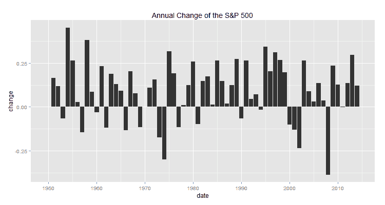

<!--yml

分类：未分类

日期：2024-05-18 14:50:46

-->

# 及时投资组合：管道用于绘制年度百分比变化

> 来源：[`timelyportfolio.blogspot.com/2014/11/pipeline-to-plot-annual-change.html#0001-01-01`](http://timelyportfolio.blogspot.com/2014/11/pipeline-to-plot-annual-change.html#0001-01-01)

](https://blogger.googleusercontent.com/img/b/R29vZ2xl/AVvXsEgOhWTd0T4x6C1NeYkpH_rASqNKMIBQd8pt5hhXpF90H81RQFgVpnrUaip2nx0i7NIUlYRUmPtT-lIRw4EflpzmVVO52c7nezqvwZautdYvRoh2FtoBYo30jz-drML38GtzCNdQTeWR5Q/s1600-h/image%25255B4%25255D.png)

*（感谢[tradeblotter](http://tradeblotter.wordpress.com)指出第一版代码中的错误）*

在 R 中使用管道让我的工作变得异常轻松，我也认为我的代码更易读。请注意，管道有几种不同的风格（参见[magrittr](https://github.com/smbache/magrittr)和[pipeR](http://renkun.me/pipeR-tutorial/)）。现在，我选择使用 pipeR。

```
library(quantmod)
library(pipeR)
library(ggplot2)

getSymbols("^GSPC",from="1900-01-01",auto.assign=F) %>>% #get S&P 500 from Yahoo!Finance
  ( .[endpoints(.,"years"),4] ) %>>% #get end of year
  ROC( type="discrete", n=1 ) %>>%   #get one year rate of change
  na.fill(0) %>>%                    #fill first year with 0
  (                                  #make data.frame
    data.frame(
      date = as.Date(format(index(.),"%Y-01-01"))
      ,.
    )
  ) %>>%
  structure(                         #hard way to do colnames()
    names = c("date","change")
  ) %>>%
  ggplot(                            #start our plot pipe
    aes( y= change, x=  date)
  ) %>>%
  + geom_bar( stat="identity" ) %>>% #choose bar
  + labs( title = "Annual Change of the S&P 500" ) #give plot a title
```

如果我们想要使用新的管道语法来绘制部分。

```
library(quantmod)
library(pipeR)
library(ggplot2)

getSymbols("^GSPC",from="1900-01-01",auto.assign=F) %>>% #get S&P 500 from Yahoo!Finance
  ( .[endpoints(.,"years"),4] ) %>>% #get end of year
  ROC( type="discrete", n=1 ) %>>%   #get one year rate of change
  na.fill(0) %>>%                    #fill first year with 0
  (                                  #make data.frame
    data.frame(
      date = as.Date(format(index(.),"%Y-01-01"))
      ,.
    )
  ) %>>%
  structure(                         #hard way to do colnames()
    names = c("date","change")
  ) %>>%
  (
    pipeline({
      ggplot(., aes( y= change, x=  date) )
      + geom_bar( stat="identity" )
      + labs( title = "Annual Change of the S&P 500 (source: Yahoo! Finance)" )
    })
  )
```
