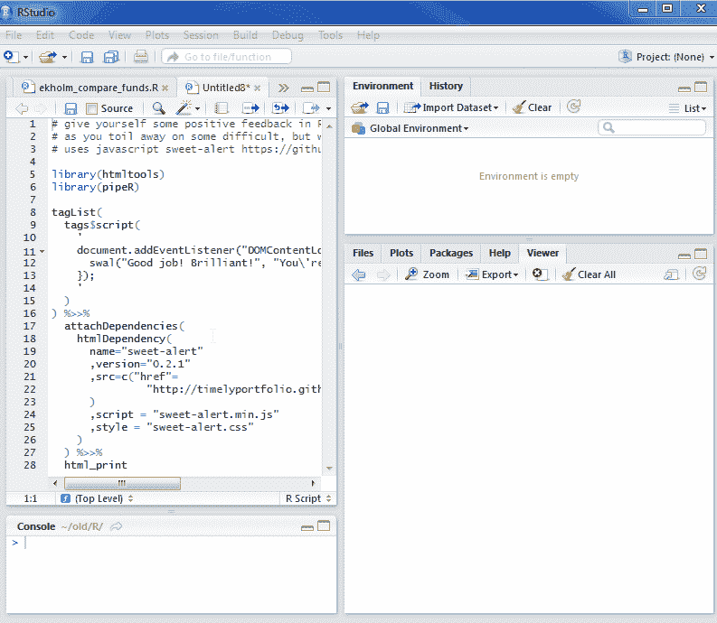

<!--yml

类别：未分类

日期：2024-05-18 14:50:59

-->

# 及时投资组合：用一点 JavaScript 在 R 中获取正面反馈

> 来源：[`timelyportfolio.blogspot.com/2014/10/postive-feedback-in-r-with-little.html#0001-01-01`](http://timelyportfolio.blogspot.com/2014/10/postive-feedback-in-r-with-little.html#0001-01-01)

让我们面对现实吧，有时在 R 中的挣扎可能会变得令人沮丧、抑郁、恐惧，或者只是单调。当您需要一点正面反馈、一些鼓励或一个拍背时，我认为这可能会有所帮助。也许我应该把这个做成一个包。

我从[Bootstrap 的 Sweet Alert](http://lipis.github.io/bootstrap-sweetalert/)找到这个，它是由[Tristan Edwards](https://twitter.com/t4t5)发起的，非 Bootstrap 的[SweetAlert](http://tristanedwards.me/sweetalert)。这是建立在我之前帖子[SVG + a little extra (d3.js) in RStudio Browser | No Pipes This Time](http://timelyportfolio.blogspot.com/2014/10/svg-little-extra-d3js-in-rstudio.html)中使用的技术。



```
# give yourself some positive feedback in R
# as you toil away on some difficult, but worthwhile task
# uses javascript sweet-alert https://github.com/t4t5/sweetalert

library(htmltools)
library(pipeR)

tagList(
  tags$script(
    '
    document.addEventListener("DOMContentLoaded", function(event) { 
      swal("Good job! Brilliant!", "You\'re doing worthwhile things.", "success")
    });
    '
  )
) %>>%
  attachDependencies(
    htmlDependency(
      name="sweet-alert"
      ,version="0.2.1"
      ,src=c("href"=
               "http://timelyportfolio.github.io/sweetalert/lib"
      )
      ,script = "sweet-alert.min.js"
      ,style = "sweet-alert.css"
    )
  ) %>>%
  html_print
```
