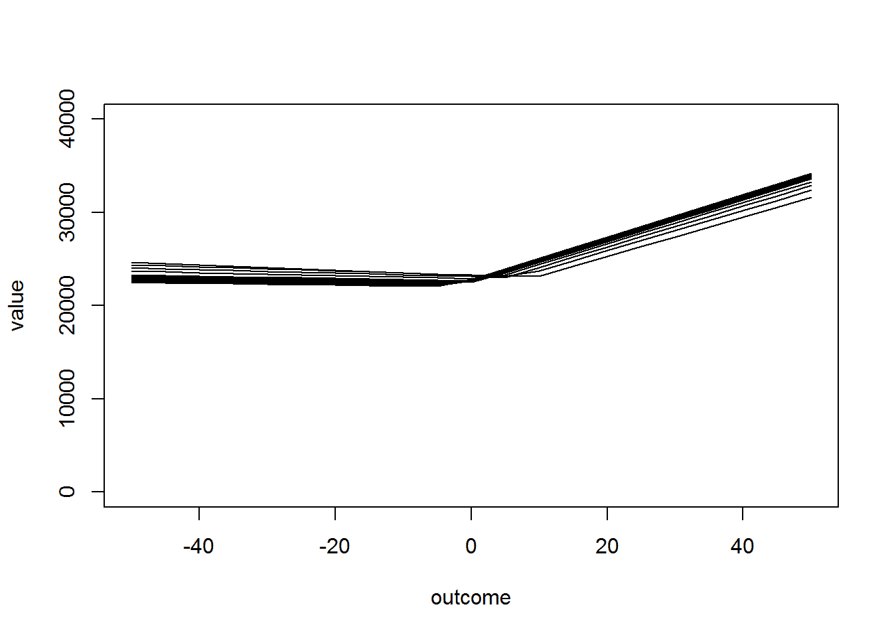

<!--yml

类别：未分类

日期：2024-05-18 14:49:29

-->

# Timely Portfolio: Puts as Protection

> 来源：[`timelyportfolio.blogspot.com/2017/03/puts-as-protection.html#0001-01-01`](http://timelyportfolio.blogspot.com/2017/03/puts-as-protection.html#0001-01-01)

许多资产管理公司正欣然享受创纪录的收入和利润，这并非由有机增长或精湛的投资组合管理驱动，而是由美国股市似乎无止境的上涨所推动。这些公司实际上是完全依赖指数价格的商品生产商，而该指数是公司无法控制的。期权市场以看跌期权的形式提供了一种简单、便宜、流动性强的保护方式，公司可以用它来对冲其收入、客户或两者兼而有之。然而，许多这些公司却对对称算术的残酷视而不见，选择忽略这种保护机会。

以下是非常快速且简陋的代码，任何人都可以用它来评估各种看跌期权作为对冲及其潜在结果。我希望有人，在任何地方都能从这个想法中受益

### 加载我们的实用包

```
library(quantmod)
library(purrr)
library(dplyr)
library(pipeR)
library(tibble)
```

### 使用 quantmod 收集数据

```
getSymbols("SPY")
```

```
## [1] "SPY"
```

```
spy_opts <- getOptionChain("SPY", Exp = "2017-12-15")
```

### 构建简单的对冲组合

```
outcomes <- spy_opts$puts %>%
  tbl_df() %>%
  filter(Strike >= 230, Strike <= 260, Ask > 0) %>%
  mutate(
    spy_pos = floor(100*tail(SPY,1)[[4]]-100*Ask),
    option_pos = ceiling(100*Ask)
  ) %>%
  select(Strike, spy_pos, option_pos)

portfolio <- map(
  seq_len(nrow(outcomes)),
  ~.x %>>%
    {outcomes[.,]} %>>%
    (strike~{
      map(
        seq(-50,50,5),
        ~tibble(
          outcome = .x,
          value = strike$spy_pos * (1+.x/100) + 
                  max(c(strike$Strike - tail(SPY)[[4]] * (1+.x/100),0)) * 100
        )
      ) %>>%
        bind_rows()
    })
)

strike_port <- tibble(
  strike = outcomes$Strike,
  outcomes = map(portfolio, ~.x)
)
```

### 以 $ 显示结果

```
plot(
  value ~ outcome,
  data = strike_port[1,]$outcomes[[1]],
  ylim = c(0,40000),
  type = "l"
)
walk(
  seq_len(nrow(strike_port)),
  ~lines(value ~ outcome, data = strike_port[.x,]$outcomes[[1]])
)
```



### 在 Plotly 中使结果具有互动性

```
library(plotly)

pltly <- reduce(
  1:nrow(strike_port),
  function(left, right) {
    left %>%
      add_lines(
        x = strike_port[right,]$outcomes[[1]]$outcome,
        y = strike_port[right,]$outcomes[[1]]$value/(100*tail(SPY,1)[[4]]) - 1,
        inherit = FALSE,
        name = strike_port[right,]$strike
      )
  }, 
  .init = plot_ly()
)
```

[Plotly 实时示例](https://bl.ocks.org/timelyportfolio/raw/153eb2a6f42a74196985771fd4192b0b/)
