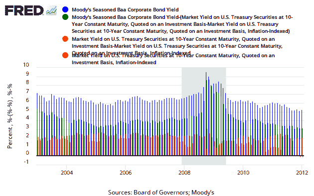

<!--yml

类别：未分类

日期：2024-05-18 15:09:08

-->

# 及时投资组合：关于债券回报率组成部分的快速更新

> 来源：[`timelyportfolio.blogspot.com/2012/01/quick-update-on-components-of-bond.html#0001-01-01`](http://timelyportfolio.blogspot.com/2012/01/quick-update-on-components-of-bond.html#0001-01-01)

在[真实挤压](http://timelyportfolio.blogspot.com/2011/08/real-squeeze.html)、[保证实际回报率-1%！美味？？](http://timelyportfolio.blogspot.com/2011/08/1-guaranteed-real-real-return-yummy.html)和[债券回报率的历史来源](http://timelyportfolio.blogspot.com/2011/04/historical-sources-of-bond-returns.html)中，我提供了一些债券回报率的历史视角：通货膨胀、实际回报率和信用。假设美国国债没有信用风险（考虑到这个[彭博关于美国国债 CDS 的引用](http://www.bloomberg.com/quote/CT786916:IND)可能不是一个好的假设），公式是固定的，除了通货膨胀之外的所有输入都在事前行提供。尽管债券价格可能波动很大（[极端债券回报](http://timelyportfolio.blogspot.com/2012/01/extreme-bond-returns.html)），但债券及其债券指数的生命周期经验由到期收益率决定。不幸的是，这种预期通货膨胀或通货紧缩的保证经验并不那么愉快。

虽然每个人都应该知道 R，我理解一些读者会更喜欢一条更容易的路线。[FRED](http://research.stlouisfed.org/fred2)像往常一样提供了帮助。然而，不幸的是，不允许标记。这些代码可以按以下方式翻译：

+   DBAA = BAA 的总回报率

+   DBAA – (DGS10 – DFII10) = 信用回报率

+   DGS10 – DFII10 = 预期通货膨胀率

+   DGS10 = 实际回报率

在追求持续改进的精神下，现在这里有一个使用 lattice 和 latticeExtra 的图表。

[R 代码现在在 GIST 中](https://gist.github.com/1601483)
