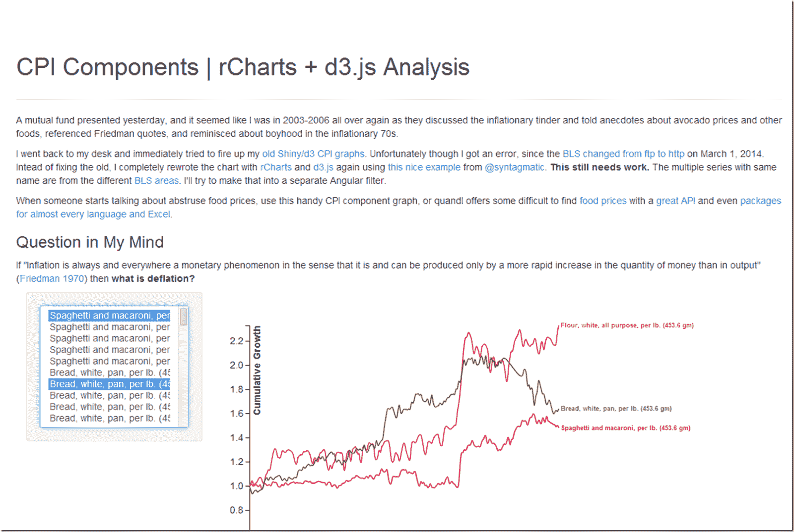

<!--yml

分类：未分类

日期：2024-05-18 14:54:27

-->

# Timely Portfolio: R 作为发布引擎 | CPI 组件用例

> 来源：[`timelyportfolio.blogspot.com/2014/04/r-as-publishing-engine-cpi-components.html#0001-01-01`](http://timelyportfolio.blogspot.com/2014/04/r-as-publishing-engine-cpi-components.html#0001-01-01)

R 当然不是为了成为一个发布引擎而设计的，但在我的工作流程中，R 是内容创作的主要方法。考虑到这一点，我一直都在思考 rCharts 的一个非常不同的用例，在这个用例中，我们可能希望在文档中包含一些僵硬且实际上不可重用的自定义 JavaScript 组件。作为一个快速的例子，在更新了我的 CPI 组件图表使用 d3.js 和 angular 之后，我想将其插入到文档中，并且实际上只需要修改几个参数。尽管有人可能会用这个处理不同的数据，但我怀疑是否会这样。

rCharts 与 knitr/slidify/Rpres 的无缝集成使得这一切变得非常简单。我只是在想这会变得有多流行。

(http://timelyportfolio.github.io/rCharts_d3_cpi/index.html)
