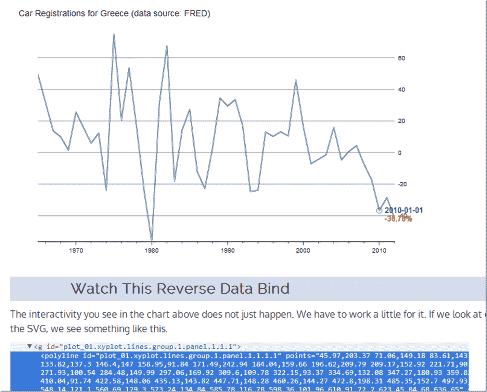

<!--yml

类别：未分类

日期：2024-05-18 14:58:22

-->

# Timely Portfolio: R/gridSVG/d3 线反向数据绑定

> 来源：[`timelyportfolio.blogspot.com/2013/08/rgridsvgd3-line-reverse-data-bind.html#0001-01-01`](http://timelyportfolio.blogspot.com/2013/08/rgridsvgd3-line-reverse-data-bind.html#0001-01-01)

我从金融转向科技，所以这次让我们用一些来自 FRED/OECD 的数据。我认为我不需要过多评论希腊新车注册发生了什么。

从 ggplot2 或 lattice 反向绑定线图稍微比上篇文章中看到的困难一些[我想要 ggplot2/lattice 和 d3（gridSVG—粘合剂）](http://timelyportfolio.blogspot.com/2013/08/gridsvganother-glue-for-r-to-svg.html)。这里有一个快速教程，介绍我们可以完成这种方法的一种方式。点击这个[链接](http://timelyportfolio.github.io/gridSVG_d3_line/)或下面的屏幕截图。

(http://timelyportfolio.github.io/gridSVG_d3_line/)

正如往常一样，这是完全可复制的。请查看[Github 上的代码](https://github.com/timelyportfolio/gridSVG_d3_line)。
