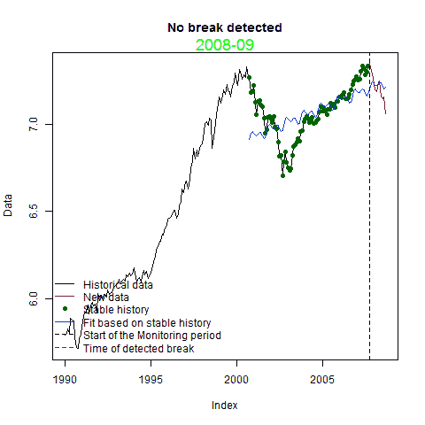

<!--yml

分类：未分类

日期：2024-05-18 15:07:16

-->

# 及时投资组合：实时结构断裂

> 来源：[`timelyportfolio.blogspot.com/2012/04/real-time-structural-break.html#0001-01-01`](http://timelyportfolio.blogspot.com/2012/04/real-time-structural-break.html#0001-01-01)

昨天当我玩 bfast 时，我一直在想“是的，但是这都是事后诸葛亮。我怎么能 potentially 把这个用在系统里？” 幸运的是，其中一位优秀作者非常慷慨地评论了我的帖子 [结构断裂（牛市或熊市？）](http://timelyportfolio.blogspot.com/2012/04/structural-breaks-bull-or-bear.html):

> “Jan Verbesselt 2012 年 4 月 27 日 02:01 AM
> 
> 好用的应用！你还可以检测季节性中断。也查看一些使用 bfastmonitor()的新近实时干扰检测功能 [`bfast.r-forge.r-project.org/Verbesselt+Zeileis+Herold-2012.pdf`](http://bfast.r-forge.r-project.org/Verbesselt+Zeileis+Herold-2012.pdf)
> 
> 干杯，Jan”

检测以及在 bfastmonitor 中的意外但非常愉快的旅程。请参阅以下论文以获取所有详细信息。

> [Jan Verbesselt, Achim Zeileis, Martin Herold (2011). Near Real-Time Disturbance
> 
> 利用卫星图像时间序列在陆地生态系统中进行检测：干旱
> 
> 检测在索马里。2011-18 号工作论文。经济学和工作论文。
> 
> 统计学，研究平台实证与实验经济学，因斯布鲁克大学
> 
> 因斯布鲁克。网址 [`EconPapers.RePEc.org/RePEc:inn:wpaper:2011-18`](http://scholar.google.com/scholar?cluster=9016488513865299942&hl=en&as_sdt=0,1)

进行前瞻性测试似乎是测试和说明的最佳方法，因此我选择了从 2008 年底到 2009 年初这段痛苦而极具波动性的时期作为例子。令人惊讶的是，在没有优化或人工干预的情况下，它选择了 2009 年 3 月作为断裂点。当然，直到 3 月底我们才知道这一点，但是仅用一个月的时间滞后就能实时选择对我来说是不敢相信的。请尝试一下，并让我知道你的结果。当然，我已经把 30 年的债券牛市作为下一个试验对象。

感谢再次出现的谢益辉（Yihui Xie）([查看关于 knitr 的帖子](http://timelyportfolio.blogspot.com/search/label/knitr))和他的动画包，我用它创建了一个古老而传统的动画 GIF。我希望我有更多时间去尝试该包提供的更漂亮、更健壮的选项。

(https://blogger.googleusercontent.com/img/b/R29vZ2xl/AVvXsEjTBXCl0YwcHCDuo1awf-OIpQ4ocQ1m0Tob2bA43nYd14MssSyVF7qVg_2-Au3KO3BytjY76o4qlwa8Ey5jduk4Le7z_eMsrNjYc7Fdh4eKr7U2VGfjKSdMHjQ9UWuOHZt-wrF3RDL5IQ/s1600-h/animation%25255B2%25255D.gif)

[R 代码来自 GIST：](https://gist.github.com/2510469)
