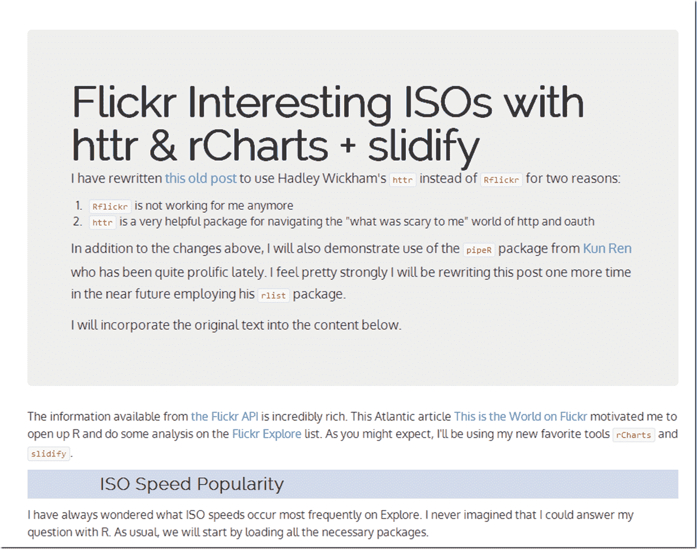

<!--yml

分类：未分类

日期：2024-05-18 14:52:22

-->

# 及时投资组合：使用`httr`和`pipeR`刷新旧 rCharts+flickr 帖子

> 来源：[`timelyportfolio.blogspot.com/2014/07/refresh-old-rchartsflickr-post-with.html#0001-01-01`](http://timelyportfolio.blogspot.com/2014/07/refresh-old-rchartsflickr-post-with.html#0001-01-01)

在 R 世界里，一直在不断进步，我注意到[这篇旧帖子](http://timelyportfolio.blogspot.com/2013/10/iso-popularity-on-flickr-explore.html)已经无法正常工作了，因此我重新编写了它，用 Hadley Wickham 的[`httr`](http://github.com/hadley/httr)代替了`Rflickr`，原因有两个：

1.  `Rflickr`对我不再起作用

1.  `httr`是一个非常有用的包，用于导航对我来说“可怕”的 http 和 oauth 世界

除了上述更改之外，我还将展示来自[Kun Ren](http://renkun.me/)的[`pipeR`](http://renkun.me/blog/2014/08/08/difference-between-magrittr-and-pipeR.html)包的使用，他最近非常活跃。我觉得我将来（已经完成）会再次重写这篇文章，并使用他的[`rlist`](http://renkun.me/rlist/)包。

](http://timelyportfolio.github.io/rCharts_Rflickr/iso_httr.html)
