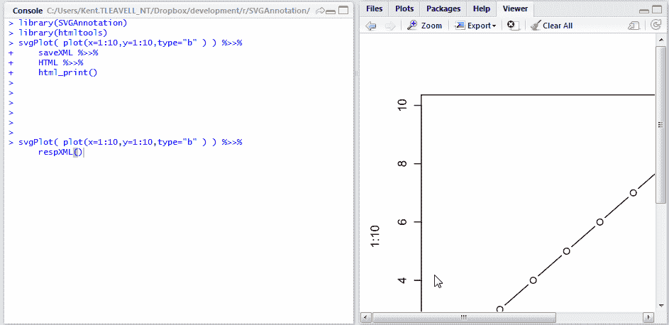

<!--yml

category: 未分类

date: 2024-05-18 14:51:28

-->

# Timely Portfolio: 在您的 RStudio 浏览器中使用响应式 SVG

> 来源：[`timelyportfolio.blogspot.com/2014/10/reponsive-svg-in-your-rstudio-browser.html#0001-01-01`](http://timelyportfolio.blogspot.com/2014/10/reponsive-svg-in-your-rstudio-browser.html#0001-01-01)

对于那些不了解的读者，SVG 绝对令人惊叹，如果你需要一些说服力，请看看 2009 年 David Dailey 的论文/演讲 [为什么 SVG 会变得非常重要？](http://www.svgopen.org/2009/papers/26-Why_is_SVG_going_to_be_REALLY_BIG_/)  大多数 R 用户应该非常熟悉使用某些命令在屏幕上魔法般地显示图形和绘图。  这些图形是光栅图，所以当你调整大小时，图形会被重新渲染以适应比例。  让我们用一个简单的绘图来看看。

```
plot(x=1:10,y=1:10,type="b")
```


SVG 的一个美妙之处在于它可以在不重新渲染的情况下进行缩放。  在 R 中创建 SVG 的旧方法是像这样做的，它产生一个我们可以使用、调整和共享的 svg 文件。

```
svg("svgplot.svg")
plot(x=1:10,y=1:10,type="b")
dev.off()
```

但是，[RStudio](http://rstudio.com) 中的集成浏览器窗口与来自 [RStudio](http://rstudio.com) 的 [HTML 辅助工具](http://github.com/rstudio/htmltools)  让我们能够实时生成和查看 SVG。  让我们再次看看我们的简单绘图，但这次是作为 SVG 在我们的 RStudio 浏览器窗口中。  我们还将使用 [SVGAnnotation](https://github.com/duncantl/SVGAnnotation) 和 [XML](http://cran.r-project.org/web/packages/XML/index.html) 这两个早熟的软件包，它们来自 Duncan Temple Lang。


****但是魔术般的可调整性在哪里呢？****

****这就是我们将要从中获得一些帮助的地方****

> ****Sara Soueidan - [理解 SVG 坐标系统和转换（第一部分）— 视口、视图框和保持纵横比](http://sarasoueidan.com/blog/svg-coordinate-systems/)****
> 
> ****Dudley Storey - [制作响应式 SVG](http://demosthenes.info/blog/744/Make-SVG-Responsive)****

****我们可以制作一个简单的函数来帮助我们实时改变属性和样式，从而得到一个漂亮的响应式 SVG。****

```
**#even better make it responsive
#use this post as a guide
#http://demosthenes.info/blog/744/Make-SVG-Responsive
respXML <- function( svg_xml, height = NULL, width = "100%", print = T, ... ){
  # svg_xml should be an XML document
  library(htmltools)
  library(pipeR)
  library(XML)

  tags$div(
    style = paste(
      sprintf('width:%s;',width)
      ,ifelse(!is.null(height),sprintf('height:%s;',height),"")
      ,"display: inline-block;"
      ,"position: relative;"
      ,"padding-bottom: 100%;"
      ,"vertical-align: middle;"
      ,"overflow: hidden;"
    )
    , ...
    ,svg_xml %>>%
      (~svg ~
         structure(ifelse(
           length(getDefaultNamespace(svg)) > 0
           ,getNodeSet(svg,"//x:svg", "x")
           ,getNodeSet(svg,"//svg")
         ),class="XMLNodeSet") %>>%
         xmlApply(
          function(s){
             a = xmlAttrs(s)
             removeAttributes(s)
             xmlAttrs(s) <- a[-(1:2)]
             xmlAttrs(s) <- c(
               style = paste0(
                 #"height:100%;width:100%;"
                 "display: inline-block;"
                 #post says use these but will not fit viewer
                 #,"position: absolute;"
                 #,"top: 0;"
                 #,"left: 0;"
               )
               #,preserveAspectRatio="xMidYMid meet"
             )
           }
         )
      ) %>>%
      saveXML %>>%
      HTML
  ) %>>%
    ( ~ if(print) html_print(.) ) %>>% 
    ( return( invisible( . ) )  )**
```

****让我们测试一下我们新的漂亮函数。****

****（https://blogger.googleusercontent.com/img/b/R29vZ2xl/AVvXsEiHJIra4LEmwDqGqayhMsilZb4LiZda01ia04kYPjtermBB1K3uTSMKMCAOxCM0PJVeGYMf6-dfTvbvqHBpI7vY8LXnQUztWuQCEbNxU-KPPl7K9TQKLi48MNIUAu7rg71Yw3PfUmPalQ/s1600-h/R_svg_2%25255B4%25255D.gif）****

****这才像样。让我们放弃动态 GIF，在下面嵌入一个 SVG（直接从 R 复制粘贴到这篇文章中）。调整你的浏览器窗口大小，测试一下结果。****

****实际上，看起来我撒谎了。SVG 并没有像在 Blogger 容器之外那样调整大小。参见 [`bl.ocks.org/timelyportfolio/raw/560e50e437d4bb1b9142/`](http://bl.ocks.org/timelyportfolio/raw/560e50e437d4bb1b9142/) 中的独立文档中的 SVG 以进行调整。****

```
**# example using dotchart documentation
# in R graphics package
# ?graphics::dotchart
svgPlot(
  dotchart(
    t(VADeaths)
    , xlim = c(0,100)
    , main = "Death Rates in Virginia - 1940"
  )
) %>>%
  respXML**
```
