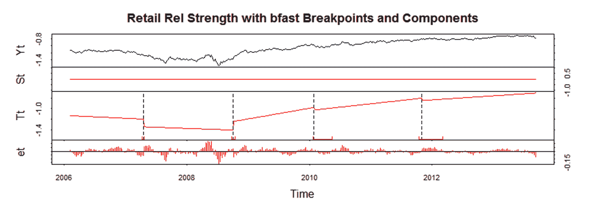
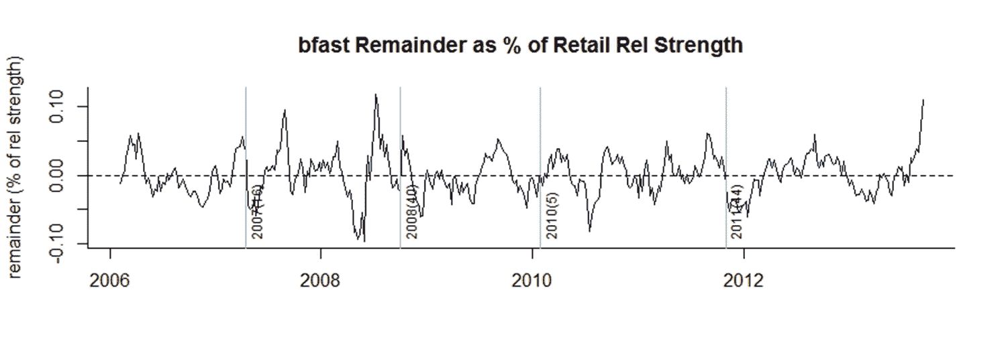

<!--yml

类别：未分类

日期：2024-05-18 14:55:37

-->

# 及时组合：零售相对强度

> 来源：[`timelyportfolio.blogspot.com/2014/01/retail-relative-strength.html#0001-01-01`](http://timelyportfolio.blogspot.com/2014/01/retail-relative-strength.html#0001-01-01)

所以，在感恩节之前，我发了一篇帖子[黑色星期五之前要思考的事情 | rChart + dygraphs](http://timelyportfolio.blogspot.com/2013/11/something-to-think-about-before-black.html)。从那以后，我发现零售业的相对强度已经大幅下降。我认为是时候用老式的 bfast（参见[帖子](http://timelyportfolio.blogspot.com/search?q=bfast)）寻找一个结构性的断裂点了。以下是输出结果。是的，我计划最终使它具有交互性，使用 rCharts。

(https://blogger.googleusercontent.com/img/b/R29vZ2xl/AVvXsEgztrGwB1xAlDNzXeBv2yuvxcC0nDWKislBE2EQFuOXgbJFMPRGDH4AowuT899pjRc50GKjEO57J8jDJ2_UupJosTtrmkwX6ZQWqTMPrADuCpJTTaSwr8ji8bwNeOJ4KofTHkaLP_znTA/s1600-h/image%25255B9%25255D.png)

剩余的部分是我认为非常有趣的。

(https://blogger.googleusercontent.com/img/b/R29vZ2xl/AVvXsEgUsTVB1Q_tXL-zfee5HxR0KNTGW7PYSzmkFNV8StAGE_WGUjff49mgQkdbzBuKYT9KlMARB2X7rCmV1gX45VosT0lWkJPwUGGuo7apxuJ51d0h3TldPgfqZW0yvDqK8SZCw3piqu-mjw/s1600-h/image%25255B8%25255D.png)

代码：
