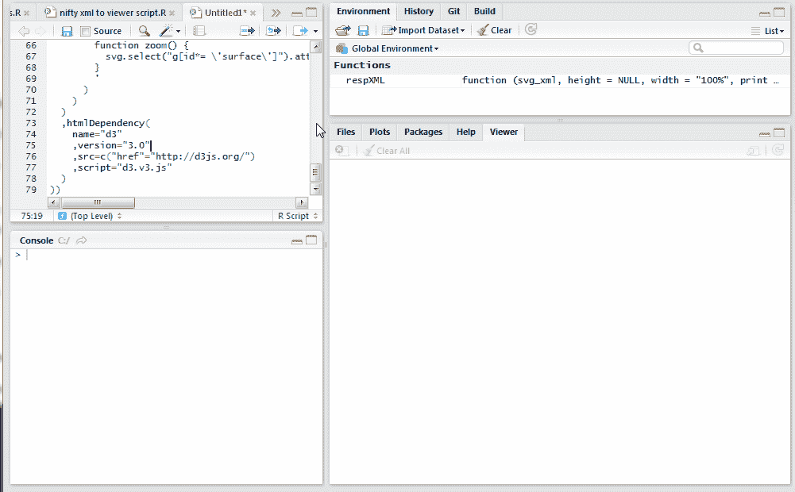

<!--yml

分类：未分类

日期：2024-05-18 14:51:19

-->

# Timely Portfolio: SVG + a little extra (d3.js) in RStudio Browser | No Pipes This Time

> 来源：[`timelyportfolio.blogspot.com/2014/10/svg-little-extra-d3js-in-rstudio.html#0001-01-01`](http://timelyportfolio.blogspot.com/2014/10/svg-little-extra-d3js-in-rstudio.html#0001-01-01)

我猜在这里，但昨天的帖子[在 RStudio 浏览器中的响应式 SVG](http://timelyportfolio.blogspot.com/2014/10/reponsive-svg-in-your-rstudio-browser.html)可能引起了一些“但是...)”、“是的，加我需要””、“%>>%管道是怎么回事”等。我将在这篇简短的文章中尝试解决其中的一些问题。

首先，如果你不喜欢管道，这是非管道版本的代码。我还做了一个改动，假设你想让 SVG 填充<div>容器。如果你认为你的 HTML 中只会有一个图表和其他东西，这很有帮助。

```
library(SVGAnnotation)
library(htmltools)

respXML <- function( svg_xml, height = NULL, width = "100%", print = T, ... ){
  # svg_xml should be an XML document
  library(htmltools)
  library(XML)

  svg <- structure(
    ifelse(
      length(getDefaultNamespace(svg_xml)) > 0
      ,getNodeSet(svg_xml,"//x:svg", "x")
      ,getNodeSet(svg_xml,"//svg")
    )
    ,class="XMLNodeSet"
  )

  xmlApply(
    svg
    ,function(s){
     a = xmlAttrs(s)
     removeAttributes(s)
     xmlAttrs(s) <- a[-(1:2)]
     xmlAttrs(s) <- c(
       style = paste0(
         "height:100%;width:100%;"
       )
     )
    }
  )

  svg <- HTML( saveXML( svg_xml) )

  svg <- tags$div(
      style = paste(
        sprintf('width:%s;',width)
        ,ifelse(!is.null(height),sprintf('height:%s;',height),"")
      )
      ,svg
    )

  if(print) html_print(svg) 

  return( invisible( svg ) )
}

```

第二，我喜欢它，但没有我的 JavaScript 辅助库我是无助的，比如[d3.js](http://d3js.org)、[Snap.svg](http://snapsvg.io)、[Raphaël](http://raphaeljs.com/)等。htmltools 使附带依赖项变得相当容易。让我们在这个例子中添加[d3.js](http://d3js.org)。

第三，我想使用我的辅助库添加一些脚本来做一些很棒的事情。我帮不了很棒的部分，但我可以告诉你如何添加一点代码。这次我们将从[ggplot2 遇见 d3](http://timelyportfolio.blogspot.com/2013/08/ggplot2-meet-d3.html)中取得简单的平移/缩放代码，以下是结果。请理解这只有 4 行 JavaScript，所以平移/缩放远不如我所期望的那样精细。

(https://blogger.googleusercontent.com/img/b/R29vZ2xl/AVvXsEjOjxJKoUPuHkTNp1fN8YnvUX3SJ7SWRuY0ph7pVfZdh6HevzkAUAxPMrOAgK7Ycv3L3cF4BxHYdqf4c42CKA0ZE7DaJ8JG24bHolXsA3u82jZ-q_K4bgcGLznFPPD4XgVplw5d-L_uxA/s1600-h/R_svg_d3js%25255B4%25255D.gif)

```
# make our plot here
# since we will need to manipulate to add a g container
# for smoother d3 pan/zoom
sP = respXML( 
  svgPlot(
    dotchart(
      t(VADeaths)
      , xlim = c(0,100)
      , main = "Death Rates in Virginia - 1940"
    )
  )
  , height = "100%"
  , print = F
)

# parse the plot html with rvest
sP = html(as.character(sP))
# add a g node to contain the plot
#  for smoother d3 pan / zoom
g = newXMLNode("g")
# add the old g to our new g container
addChildren(g, html_nodes(sP,"svg > g"))
# add our new g container to our svg
addChildren(html_nodes(sP,"svg")[[1]],g)

html_print(attachDependencies(
  tagList(
    # get the div with our modified svg
    HTML(saveXML(html_nodes(sP,"div")[[1]]))
    , tags$script(
      HTML(
        '
        var g = d3.select("svg > g");
        var zoom = d3.behavior.zoom().scaleExtent([1, 8]).on("zoom", zoomed)
        g.call(zoom)

        function zoomed() {
          g.select("g")
            .attr(
              "transform",
              "translate(" + d3.event.translate + ")scale(" + d3.event.scale + ")"
            );
        }
        '
      )
      )
      )
  ,htmlDependency(
    name="d3"
    ,version="3.0"
    ,src=c("href"="http://d3js.org/")
    ,script="d3.v3.js"
  )
      ))
```
