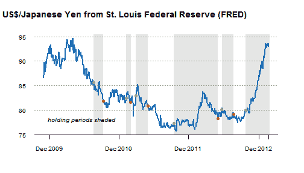

<!--yml

类别：未分类

date: 2024-05-18 15:01:13

-->

# 及时投资组合：使用 xtsExtra plot.xts 进行着色和标注

> 来源：[`timelyportfolio.blogspot.com/2013/02/shading-and-points-with-xtsextra-plotxts.html#0001-01-01`](http://timelyportfolio.blogspot.com/2013/02/shading-and-points-with-xtsextra-plotxts.html#0001-01-01)

不知何故，我感觉使用[xtsExtra 包](https://r-forge.r-project.org/scm/viewvc.php/pkg/xtsExtra/?root=xts)中的[plot.xts 函数](http://timelyportfolio.blogspot.com/search/label/plot.xts)比使用其他一些更精细的 R 图形包要有更好的控制。也许，这只是我简单的头脑，但最近我想要为购买和销售日期着色并标注。使用 xtsExtra 中的 plot.xts，我能够快速轻松地生成以下图表。我确实必须稍微修改了原始的 plot.xts 函数，如[这里](https://github.com/timelyportfolio/plotxts_shading_points/commit/1c245ba0878a5c5b1c09851903288c4515c68297)所示，但它似乎更自然，而且挣扎得少得多。

我也喜欢几乎完全用 R markdown 编写的这篇文章。

[Github 上的 R 代码](https://raw.github.com/timelyportfolio/plotxts_shading_points/master/shading%20and%20points%20with%20xtsExtra%20plot.rmd)：
