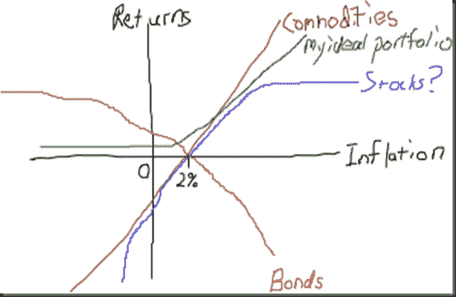

<!--yml

分类：未分类

日期：2024-05-18 15:25:00

-->

# 及时投资组合：简单回报图

> 来源：[`timelyportfolio.blogspot.com/2011/01/simple-return-graph.html#0001-01-01`](http://timelyportfolio.blogspot.com/2011/01/simple-return-graph.html#0001-01-01)

我刚刚发现并非常喜欢[`thisisindexed.com`](http://thisisindexed.com "http://thisisindexed.com")。这是我的第一次尝试。任何债券的最大敌人都是通货膨胀，利率越低，对通货膨胀的防御越低。之前的帖子有关于黄金和债券的思考。

(https://blogger.googleusercontent.com/img/b/R29vZ2xl/AVvXsEhbS7JVMtWX6AAGc6FVy3mB6Jj3sAyvZT80HQmM28Ahf2Xj3D8PnwAIH3yaszPZ7wLlfIy2LQYrEj_gKNM_0hmIZqESQNBst5FRb9MeyWKwU12m5p_HyyMjZcy7cOOCMp7g3XCMTocMaA/s1600-h/image%5B14%5D.png)

时长：*30 分钟*
