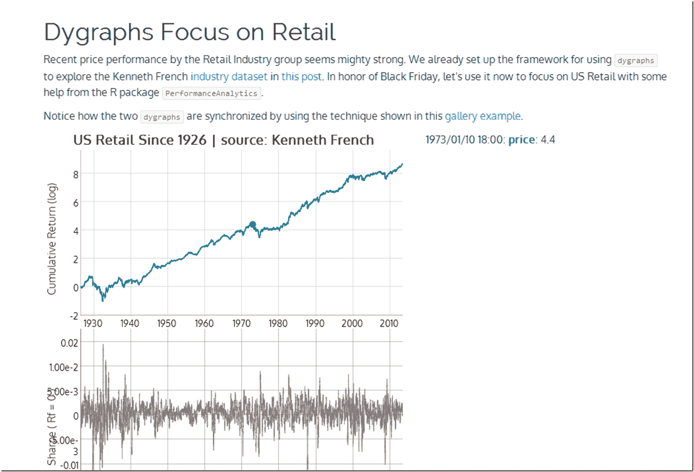

```yml

分类：未分类

日期：2024-05-18 14:55:54

→

# 及时投资组合：黑色星期五之前需要考虑的事情 | rChart + dygraphs

> 来源：[`timelyportfolio.blogspot.com/2013/11/something-to-think-about-before-black.html#0001-01-01`](http://timelyportfolio.blogspot.com/2013/11/something-to-think-about-before-black.html#0001-01-01)

美国零售股的表现一直很出色。由于黑色星期五开始的假日季节对零售业至关重要，所以我们使用 R [rCharts](http://rcharts.io/howitworks)和绩效分析+ JavaScript [dygraphs](http://dygraphs.com)来查看美国零售行业的价格和夏普比率。再次感谢 Kenneth French 提供的[数据集](http://mba.tuck.dartmouth.edu/pages/faculty/ken.french/data_library.html)。

](http://timelyportfolio.github.io/rCharts_dygraphs_posts/retail.html)
