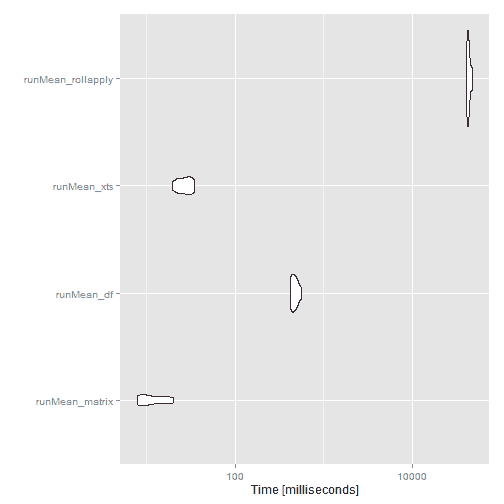
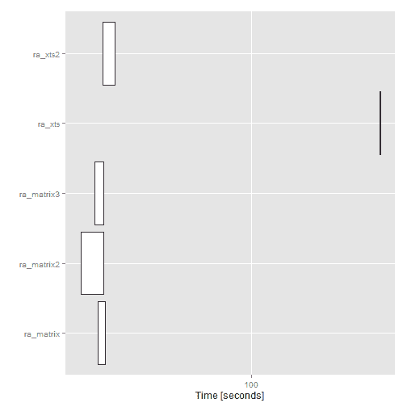

<!--yml

category: 未分类

date: 2024-05-18 14:52:53

-->

# 及时投资组合：滚动/运行函数的速度测试

> 来源：[`timelyportfolio.blogspot.com/2014/07/speed-tests-for-rollingrunning-functions.html#0001-01-01`](http://timelyportfolio.blogspot.com/2014/07/speed-tests-for-rollingrunning-functions.html#0001-01-01)

我几乎每天都使用金融时间序列进行滚动和运行函数。在我的帖子[A Whole New World with Chains and Pipes](http://timelyportfolio.blogspot.com/2014/06/a-whole-new-r-world-with-chains-and.html)中，我提出了这样一个说法

> 我注意到使用 xts 进行滚动分析有时可能会很慢。`as.matrix` 是我加快速度的最爱，因为我通常不需要 xts 强大的索引和子集功能。

我觉得我应该更加全面，所以我做了几个运行和滚动函数的速度测试。如果有更快的方法，请告诉我。

我之前没有见过的一种方法是在评论中提供的，所以我将其提升到了此帖子的正文中。

> 嗨，这里也有一个很好的基准（适用于可变窗口宽度）提供在此处：[`stackoverflow.com/quest...`](http://stackoverflow.com/questions/21368245/performance-of-rolling-window-functions-in-r)

```
require(microbenchmark)
require(ggplot2)

require(xts)
require(quantmod)
require(PerformanceAnalytics)

require(dplyr);require(magrittr)

require(Gmisc)  #for pretty html tables 
```

#### 随机数据 | 矩阵，数据框和 xts 与 dplyr

对于我们的测试，让我们创建一些具有 10 列和 100,000 行的随机数据。如果这是每日的金融数据，100,000 将我们带回约 1740 年。我希望我当时有好的数据。我们将创建一个 `matrix`，`data.frame` 和 `xts` 对象。

```
playData.matrix <- matrix(runif(1000000,-.03,.03), ncol=10)

playData.df <- 
  playData.matrix %>%
  as.data.frame %>% 
  tbl_df

#make some dates by adding days to the first day of 1740
#in a playful magrittr way (please don't do this at homr)
playDates <- 1:(playData.matrix %>% nrow) %>% as.Date(origin="1740-01-01")

#make an xts dataset with our playData with index playDates
playData.xts <- 
  playData.matrix %>%
  as.xts(order.by=playDates) 
```

#### 运行 | Fortran 的美

[`ttr` 作者](https://r-forge.r-project.org/projects/ttr/) 使用 [Fortran 和 C](https://r-forge.r-project.org/scm/viewvc.php/pkg/src/?root=ttr) 使运行函数真正快速。

```
mb_runMean <- microbenchmark(
  runMean_matrix = runMean(playData.matrix, n = 50 )
  ,runMean_df = runMean( playData.df, n = 50 )
  ,runMean_xts = runMean( playData.xts, n = 50 )
  #show the beauty of Fortran in the above runMean calcs
  ,runMean_rollapply = rollapply(playData.matrix, width = 50, by = 1, FUN="mean")
,times=10L) 
```

##### runMean 微基准结果

| summary | expr | min | lq | median | uq | max | neval |
| --- | --- | --- | --- | --- | --- | --- | --- |
| 1 | runMean_matrix | 7.83479 | 8.328931 | 10.187089 | 15.631568 | 20.428914 | 10 |
| 2 | runMean_df | 415.200526 | 436.36685 | 463.7532645 | 504.178149 | 565.733628 | 10 |
| 3 | runMean_xts | 19.379056 | 22.689037 | 27.419294 | 31.679356 | 34.873025 | 10 |
| 4 | runMean_rollapply | 40530.101527 | 41679.322495 | 42675.2747235 | 43917.396031 | 47993.732396 | 10 |



#### 滚动 | 我错过了 Fortran

没有 Fortran 和 C，滚动函数会变得慢得多。但是，我们可以使用 `as.matrix` 或 `as.numeric` 来加速一点点。一旦计算完成，我们将需要使用一些日期逻辑转换回 `xts`。

```
mb_rollapply <- microbenchmark(
  ra_matrix = rollapply( playData.matrix[,1:2], width = 100 , by = 1, FUN="Omega" )

  ,ra_matrix2 = apply(
    playData.matrix[,1:2],
    MARGIN=2,
    FUN=function(col){ return(rollapply(col,width = 100 , by = 1, FUN="Omega" )) }
  )

  ,ra_xts = rollapply( playData.xts[,1:2], width = 100 , by = 1, FUN="Omega" )

  ,ra_xts2 = apply(
    playData.xts[,1:2],
    MARGIN=2,
    FUN=function(col){
      return(
        rollapply(
          as.numeric(col)
          ,width=100
          ,by=1
          ,FUN="Omega"
        )
      )
    }
  )
,times=2L) 
```

##### rollapply 微基准结果

| summary | expr | min | lq | median | uq | max | neval |
| --- | --- | --- | --- | --- | --- | --- | --- |
| 1 | ra_matrix | 26.001762182 | 26.001762182 | 26.8966084855 | 27.791454789 | 27.791454789 | 2 |
| 2 | ra_matrix2 | 22.331454712 | 22.331454712 | 24.8568809085 | 27.382307105 | 27.382307105 | 2 |
| 3 | ra_matrix3 | 25.255073874 | 25.255073874 | 26.3310039035 | 27.406933933 | 27.406933933 | 2 |
| 4 | ra_xts | 308.954120943 | 308.954120943 | 309.3609896875 | 309.767858432 | 309.767858432 | 2 |
| 5 | ra_xts2 | 27.154306816 | 27.154306816 | 28.6303421355 | 30.106377455 | 30.106377455 | 2 |


