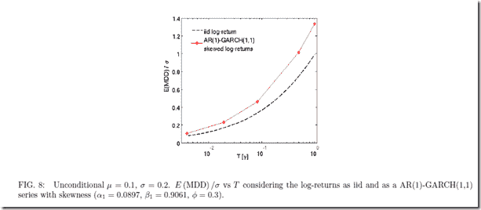
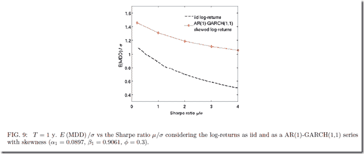
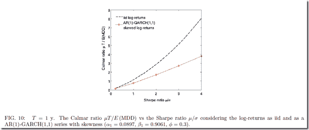

<!--yml

分类：未分类

日期：2024-05-18 15:06:15

-->

# 及时投资组合：回撤统计–论文和帖子

> 来源：[`timelyportfolio.blogspot.com/2012/06/statistics-of-drawdownpaper-and-post.html#0001-01-01`](http://timelyportfolio.blogspot.com/2012/06/statistics-of-drawdownpaper-and-post.html#0001-01-01)

非常感谢 Patrick Burns 帖子[最大回撤的变异性](http://www.portfolioprobe.com/2012/06/04/variability-in-maximum-drawdown/)。他从“最大回撤具有惊人的变异性”开始，这就是为什么资金管理如此困难的原因。在花了大量时间思考他的帖子并试图复制所引用的论文之后

> 卡萨蒂，亚历山德罗，《关于金融时间序列中最大回撤的统计》（2012 年 5 月 1 日）。可在 SSRN 上找到：[`ssrn.com/abstract=2049584`](http://ssrn.com/abstract=2049584) 或 [`dx.doi.org/10.2139/ssrn.2049584`](http://dx.doi.org/10.2139/ssrn.2049584)。

我认为累计统计数据，无论是总回报还是回撤，都与评论“图片暗示最大回撤可能是任何东西”相吻合。以下是导致这一结论的一个图表，预测的置信区间从 20%到 90%宽得惊人，并不那么有用。如果有人愿意为下一个 1,000 天内，标普 500 指数或任何股票指数回撤在 20%到 90%之间的赌注付钱给我，我会很高兴接受那个赌注，而且我不需要复杂的统计技术就能得到那种洞察力。

中提出的问题。

，[`ssrn.com/abstract=2049584`](http://ssrn.com/abstract=2049584)。

，[`ssrn.com/abstract=2049584`](http://ssrn.com/abstract=2049584)。

，[`ssrn.com/abstract=2049584`](http://ssrn.com/abstract=2049584)。

我们确实看到回报和回撤之间存在关系。

无论如何，我很高兴看到对经常被忽视的回撤统计的讨论，这对于我做出的每一个投资决策都至关重要。

[R 代码源自 GIST:](https://gist.github.com/2913982)
