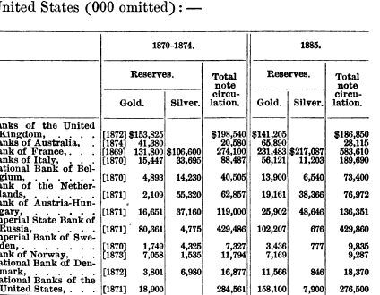

<!--yml

分类：未分类

日期：2024 年 05 月 18 日 15:00:32

-->

# Timely Portfolio: 表格就像蟑螂一样

> 来源：[Timely Portfolio: Tables Are Like Cockroaches](http://timelyportfolio.blogspot.com/2013/04/tables-are-like-cockroaches.html#0001-01-01)

尽管我很想完全用美观、直观和交互式的图表来替换所有的表格，但是像蟑螂一样，表格无法被消除。根据这个非常[有趣的在 Perceptual Edge 论坛上的讨论](http://sfew.websitetoolbox.com/post/Old-or-oldest-data-table-5702966)，引用自[探索信息可视化中表格的起源](http://api.viglink.com/api/click?format=go&key=ccc2217bc2b75c4bdf5f7e57267f0464&loc=http%3A%2F%2Fsfew.websitetoolbox.com%2Fpost%2FOld-or-oldest-data-table-5702966&v=1&libid=1365001395530&out=http%3A%2F%2Fcsis.pace.edu%2F%7Emarchese%2FPapers%2FIV11%2FMarchese_IV%252711.pdf&ref=http%3A%2F%2Fwww.google.com%2Furl%3Fsa%3Dt%26rct%3Dj%26q%3D%26esrc%3Ds%26frm%3D1%26source%3Dweb%26cd%3D2%26ved%3D0CDoQFjAB%26url%3Dhttp%253A%252F%252Fsfew.websitetoolbox.com%252Fpost%252FOld-or-oldest-data-table-5702966%26ei%3DpERcUcvxPImY9QTKi4GwCg%26usg%3DAFQjCNFppNIFLhtMVC3W9Xklbffh8lAmlA%26sig2%3DJ9ehhR3U1vkGtjw8d4sxLA%26bvm%3Dbv.44697112%2Cd.eWU&title=Old%20or%20oldest%20data%20table%20-%20Perceptual%20Edge%20Discussion%20Forum&txt=探索信息可视化中表格的起源&jsonp=vglnk_jsonp_136500185877710)，表格可以追溯到公元前 1850 年。文章总结道：

> 作为探索的一部分，表格帮助回答关于数据的问题。作为沟通的典范，表格提供了有效的手段来呈现数据 - 每个表格都有一个或多个故事要讲述。

在努力用 R 创建一些漂亮的 HTML 表格之后，我不确定在将近 4000 年后它们是否更容易创建。当涉及到制作表格的竞争时，LaTeX 显然是赢家。我使用 **xtable** 制作 HTML 表格，但它无法完全制作出复杂的表格。我很高兴最近发现了[**Gmisc**](http://gforge.se/2013/02/tables-from-r-into-word/) 包，这是一位沮丧的整形外科医生为了期刊投稿而需要在 Word 中创建表格的结果。


另一个关于从 R 到 Word 的工作流也在[使用 R 写作 MS-Word 文档（尽可能少的额外工作）](http://www.r-statistics.com/2013/03/write-ms-word-document-using-r-with-as-little-overhead-as-possible/)中讨论过。我并不知道需要从 R 生成 Word .doc。我只是认为

如果你阅读了[在现代 d3 可视化中使用旧价格表](http://timelyportfolio.blogspot.com/2013/04/old-price-tables-in-modern-d3.html)和[在 Google 书架上翻阅了 130 年前的金融书籍](http://timelyportfolio.blogspot.com/2013/03/dust-off-130-year-old-gold-books-on.html)，你就会知道我新最喜欢的书是[由詹姆斯·劳伦斯·劳夫林撰写的 1873 年以来的黄金和价格](http://books.google.com/books?id=UFMuAAAAYAAJ&printsec=frontcover#v=thumbnail&q&f=false)。这个表格在第 26 页看起来很容易重现。



我完全不知道重新创建这个表格会如何测试和提升我的 R 技能。我从手动输入数据开始，因为 OCR 没有起作用。

```
reps = c("http://ftp.sunet.se/pub/lang/CRAN", "http://cran.gforge.se")
install.packages("Gmisc", repos = reps, dependencies = TRUE) 
```

```
library(Gmisc, verbose = FALSE)

# manually enter the data in a data frame
data1874 <- data.frame(c(1872, 1874, 1869, 1870, 1870, 1871, 1871, 1871, 1870, 
    1873, 1872, 1871), c(153825, 41380, 131800, 15447, 4893, 2109, 16651, 80361, 
    1749, 7058, 3801, 18900), c(0, 0, 106600, 33695, 14230, 55320, 37160, 4775, 
    4325, 1535, 6980, 0), c(198540, 20580, 274100, 88487, 40505, 62857, 119000, 
    429486, 7327, 11794, 16877, 284561))

rownames(data1874) <- c("Banks of the United Kingdom", "Banks of Australia", 
    "Banks of France", "Banks of Italy", "National Bank of Belgium", "Bank of the Netherlands", 
    "Bank of Austria-Hungary", "Imperial State Bank of Russia", "Imperial Bank of Sweden", 
    "Bank of Norway", "National Bank of Denmark", "National Bank of the United States")
colnames(data1874) <- c(" ", "Gold", "Silver", "Total Note Circulation")

data1885 <- data.frame(c(141205, 65890, 231483, 56121, 13900, 19161, 25902, 
    102207, 3436, 7169, 11566, 158100), c(0, 0, 217087, 11203, 6540, 38366, 
    48646, 676, 777, 0, 846, 7900), c(186850, 28115, 583610, 189690, 73400, 
    76972, 136351, 429860, 9835, 9287, 18370, 276500))
colnames(data1885) <- colnames(data1874)[2:4]

# get sums for totals row in table
data1874[NROW(data1874) + 1, ] = apply(data1874, MARGIN = 2, FUN = sum)
data1885[NROW(data1885) + 1, ] = apply(data1885, MARGIN = 2, FUN = sum)
# add Total to row names
rownames(data1874)[NROW(data1874)] = "Total"
rownames(data1885)[NROW(data1885)] = "Total"
# eliminate the sum of years which does not make sense
data1874[NROW(data1874), 1] = ""

# get commas in the numbers
data1874[, 2:4] <- format(data1874[, 2:4], big.mark = ",")
data1885 <- format(data1885, big.mark = ",") 
```

然后，用**gmisc**很快地做出了一个体面的表格。

```
# use htmlTable to produce a table
htmlTable(cbind(data1874, data1885), caption = "", rowlabel = "", cgroup = c("Reserves", 
    "", "Reserves", ""), n.cgroup = c(3, 1, 2, 1, 0), ctable = TRUE, output = TRUE) 
```

|  | 储备 |   |   |   | 储备 |   |   |
| --- | --- | --- | --- | --- | --- | --- | --- |
|   |  | 黄金 | 白银 |   | 总票据流通量 |   | 黄金 | 白银 |   | 总票据流通量 |
| --- | :-: | :-: | :-: | --- | :-: | --- | :-: | :-: | --- | :-: |
| 英国银行 | 1872 | 153,825 | 0 |   | 198,540 |   | 141,205 | 0 |   | 186,850 |
| 澳大利亚银行 | 1874 | 41,380 | 0 |   | 20,580 |   | 65,890 | 0 |   | 28,115 |
| 法国银行 | 1869 | 131,800 | 106,600 |   | 274,100 |   | 231,483 | 217,087 |   | 583,610 |
| 意大利银行 | 1870 | 15,447 | 33,695 |   | 88,487 |   | 56,121 | 11,203 |   | 189,690 |
| 比利时国家银行 | 1870 | 4,893 | 14,230 |   | 40,505 |   | 13,900 | 6,540 |   | 73,400 |
| 荷兰银行 | 1871 | 2,109 | 55,320 |   | 62,857 |   | 19,161 | 38,366 |   | 76,972 |
| 奥地利匈牙利银行 | 1871 | 16,651 | 37,160 |   | 119,000 |   | 25,902 | 48,646 |   | 136,351 |
| 俄罗斯帝国国家银行 | 1871 | 80,361 | 4,775 |   | 429,486 |   | 102,207 | 676 |   | 429,860 |
| 瑞典帝国银行 | 1870 | 1,749 | 4,325 |   | 7,327 |   | 3,436 | 777 |   | 9,835 |
| 挪威银行 | 1873 | 7,058 | 1,535 |   | 11,794 |   | 7,169 | 0 |   | 9,287 |
| 丹麦国家银行 | 1872 | 3,801 | 6,980 |   | 16,877 |   | 11,566 | 846 |   | 18,370 |
| 美国国家银行 | 1871 | 18,900 | 0 |   | 284,561 |   | 158,100 | 7,900 |   | 276,500 |
| 总计 |  | 477,974 | 264,620 |   | 1,554,114 |   | 836,140 | 332,041 |   | 2,018,840 |

然而，复杂的多行标题仍然缺失，所以这是更难的蛮力工作，解析 HTML 以正确构造表格。

```
# do all the hard work to make the table more of an exact replica
gtable_table <- htmlTable(cbind(data1874, data1885), caption = "", rowlabel = "", 
    cgroup = c("Reserves", "", "Reserves", ""), n.cgroup = c(3, 1, 2, 1, 0), 
    ctable = TRUE, output = FALSE)

require(XML)
# parse the table so that we can access the elements in a very crude
# manner
doc <- htmlParse(gtable_table)
# add another row heading to the table with XML
temp <- addChildren(getNodeSet(doc, "//thead")[[1]], newXMLNode("tr", list(newXMLNode("th", 
    attrs = list(colspan = "1", style = "font-weight: 900; border-top: 2px solid grey;border-right: 1px solid grey;"), 
    text = ""), newXMLNode("th", attrs = list(colspan = "6", style = "font-weight: 900; border-top: 2px solid grey;"), 
    text = "1870-1874"), newXMLNode("th", attrs = list(colspan = "5", style = "font-weight: 900; border-top: 2px solid grey;"), 
    text = "1885"))), at = 0)

# add some vertical borders; wish this were easier but very manual
th <- getNodeSet(doc, "//thead//th")  #start with the th elements in thead
for (i in c(1, 2, 4, 8, 12, 18)) {
    oldstyle <- xmlAttrs(th[[i]])["style"]  #get the old style attribute
    removeAttributes(th[[i]], attrs = "style")  #remove the style attribute
    addAttributes(th[[i]], style = paste(oldstyle, "border-right: 1px solid grey;", 
        sep = ""))  #add the old style attribute concatenated with border-right
}

th <- getNodeSet(doc, "//tbody//td")  #now do the td elements in tbody
for (i in c(seq(1, 133, by = 11), seq(7, 139, by = 11))) {
    oldstyle <- xmlAttrs(th[[i]])["style"]  #get the old style attribute
    removeAttributes(th[[i]], attrs = "style")  #remove the style attribute
    addAttributes(th[[i]], style = paste(oldstyle, "border-right: 1px solid grey;", 
        sep = ""))  #add the old style attribute concatenated with border-right
}

# although htmlTable will group rows, I could not make it do what I wanted
# so add underline before the total row
for (i in 133:143) {
    oldstyle <- xmlAttrs(th[[i]])["style"]  #get the old style attribute
    removeAttributes(th[[i]], attrs = "style")  #remove the style attribute
    addAttributes(th[[i]], style = paste(oldstyle, "border-top: 1px solid grey;", 
        sep = ""))  #add the old style attribute concatenated with border-top
}

# for some reason &nbsp; becomes Â, so reverse it back to $nbsp;
returnHTML <- gsub("[Â].", replacement = "&nbsp;", saveXML(getNodeSet(doc, "//table")[[1]]))

# not sure if necessary but free up doc from memory
free(doc)

cat(returnHTML) 
```

|  | 1870-1874 | 1885 |
| --- | --- | --- |
|  | 储备 |   |   |   | 储备 |   |   |
| --- | --- | --- | --- | --- | --- | --- | --- |
|   |  | 黄金 | 白银 |   | 总票据流通量 |   | 黄金 | 白银 |   | 总票据流通量 |
| --- | :-: | :-: | :-: | --- | :-: | --- | :-: | :-: | --- | :-: |
| 英国银行 | 1872 | 153,825 | 0 |   | 198,540 |   | 141,205 | 0 |   | 186,850 |
| 澳大利亚银行 | 1874 | 41,380 | 0 |   | 20,580 |   | 65,890 | 0 |   | 28,115 |
| 法国银行 | 1869 | 131,800 | 106,600 |   | 274,100 |   | 231,483 | 217,087 |   | 583,610 |
| 意大利银行 | 1870 | 15,447 | 33,695 |   | 88,487 |   | 56,121 | 11,203 |   | 189,690 |
| 比利时国家银行 | 1870 | 4,893 | 14,230 |   | 40,505 |   | 13,900 | 6,540 |   | 73,400 |
| 荷兰银行 | 1871 | 2,109 | 55,320 |   | 62,857 |   | 19,161 | 38,366 |   | 76,972 |
| 奥匈帝国银行 | 1871 | 16,651 | 37,160 |   | 119,000 |   | 25,902 | 48,646 |   | 136,351 |
| 俄罗斯帝国国家银行 | 1871 | 80,361 | 4,775 |   | 429,486 |   | 102,207 | 676 |   | 429,860 |
| 瑞典帝国银行 | 1870 | 1,749 | 4,325 |   | 7,327 |   | 3,436 | 777 |   | 9,835 |
| 挪威银行 | 1873 | 7,058 | 1,535 |   | 11,794 |   | 7,169 | 0 |   | 9,287 |
| 丹麦国家银行 | 1872 | 3,801 | 6,980 |   | 16,877 |   | 11,566 | 846 |   | 18,370 |
| 美国国家银行 | 1871 | 18,900 | 0 |   | 284,561 |   | 158,100 | 7,900 |   | 276,500 |
| 总计 |  | 477,974 | 264,620 |   | 1,554,114 |   | 836,140 | 332,041 |   | 2,018,840 |

这个还可以通过一些简单的 CSS 进一步改进。我希望这能帮到某人。哦，我刚刚也想起了[dprint](http://user2010.org/slides/Brickner+Slavov+Napoli.pdf)，我很快会重新审视它。现在我想我该回去画图了。
