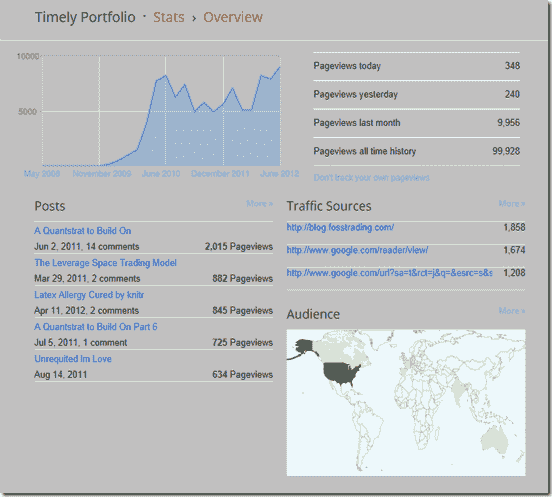

<!--yml

分类：未分类

日期：2024-05-18 15:05:50

-->

# 及时投资组合：达到 100,000

> 来源：[`timelyportfolio.blogspot.com/2012/06/turning-100000.html#0001-01-01`](http://timelyportfolio.blogspot.com/2012/06/turning-100000.html#0001-01-01)

#### 早在 2010 年 12 月，我就开始在及时投资组合这里写博客了，正如你所看到的，达到 100,000 页面浏览量是我从未预料到的事情。感谢所有激励我继续前进的读者，以及在这一路上教导我的人。

> **2010 年 12 月 8 日，星期三**
> 
> ##### 阅读->写作
> ##### 
> 我决心不仅要当观众，还要积极参与。在 20 年的大量阅读之后，我决定开始写作，这个博客代表了我的承诺。很可能它将反映我，所以这里有很多关于我的工作/激情、金钱管理以及市场的内容，但我也希望有一些有价值的思考和观察。我将成为这个项目的作者，可能是唯一的读者，但我知道我将从这项事业中获得巨大的收益。对别人的任何益处都将非常令人满意，并帮助我解决多年来娱乐和启发我的所有奇妙作者的债务。

统计数据看起来是这样的。

(https://blogger.googleusercontent.com/img/b/R29vZ2xl/AVvXsEj3Mm6VifCZzwnax43GcVs-lNG_plxfjQj5hM8xh6bxzWHKccFJIIzl2Jk5EwyHRqHtZuAaEkvowtx1re0MUkqnfJkgZ0aCoymPmO7qVVUfIK-BIBcvpoL3TKCrEZDA87-ExMag2PyZRQ/s1600-h/clip_image001%25255B5%25255D.png)
