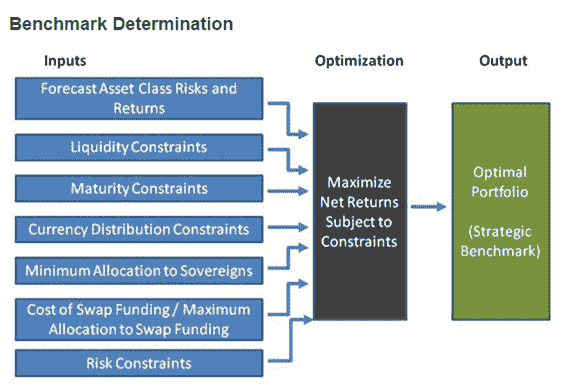

<!--yml

类别：未分类

日期：2024-05-18 14:50:14

-->

# Timely Portfolio: 圣诞节的 Widget

> 来源：[`timelyportfolio.blogspot.com/2014/12/widgets-for-christmas.html#0001-01-01`](http://timelyportfolio.blogspot.com/2014/12/widgets-for-christmas.html#0001-01-01)

圣诞节，我通常想要电子 Widget，但在[六个月的开发](https://github.com/ramnathv/htmlwidgets/commit/9b39806e6dfb3105cd875aa7103190ba2c3f98ab)后，我今年圣诞节想要的只有一个——[HTMLWidgets](http://www.htmlwidgets.org)，Santa [RStudio](http://rstudio.com/)/jj,joe,yihui 和 Santa [Ramnath](https://github.com/ramnathv)在 12 月 17 日的 RStudio 推文中提前实现了这个愿望。

HTMLWidgets 的主要好处是它提供了我在 2013 年 8 月 16 日帖子中提到的 R 与 JavaScript/HTML 的三种桥接方法[我想要 ggplot2/lattice 和 d3 (gridSVG–The Glue)](http://timelyportfolio.blogspot.com/2013/08/gridsvganother-glue-for-r-to-svg.html)。尽管如此，为了让 HTMLWidgets 取得成功，不仅需要 HTMLWidgets 本身能工作，[widget 的轻松创建也是绝对必要的](http://www.htmlwidgets.org/develop_intro.html)。

作为一个快速的例子，我们可以看看[DiagrammeR](http://github.com/rich-iannone/DiagrammeR)昨天发布的包，由[Richard Iannone](http://about.me/rich_i/)发布。DiagrammeR[推出](https://github.com/rich-iannone/DiagrammeR/commit/656116cc73941f176e93c88990603b2d5ebf38a5)时，没有 HTMLWidgets 的形式，严重限制了它在多个上下文中轻松使用的可能性。将其转换为 HTMLWidgets 似乎是一个很好的机会，既展示了 HTMLWidgets 创建的便捷性，又展示了 HTMLWidgets 提供的强大基础设施。因此，在短短几小时——容易创建，检查——昨天（大部分时间花在示例、文档和测试上）——只需[几行 JavaScript](https://github.com/rich-iannone/DiagrammeR/blob/master/inst/htmlwidgets/DiagrammeR.js#L23-L40)——再次检查创建容易性——我就能将 DiagrammeR 包转换为 HTMLWidgets。

我原以为一个金融图表将是这个博客的好例子，于是我到 Google 图片上寻找一个既好又简单的应用，并选择了加拿大财务部[这个](http://www.fin.gc.ca/treas/evaluations/eaafefa-ecracfc-eng.asp)的。

](http://www.fin.gc.ca/treas/evaluations/eaafefa-ecracfc-eng.asp)

这就是 DiagrammeR + mermaid.js 的样子。

如果我能够下定决心和承诺，我可能有一个关于 2015 年的声明——widget 年。

新年快乐，感谢 TimelyPortfolio 四年的美好时光。
