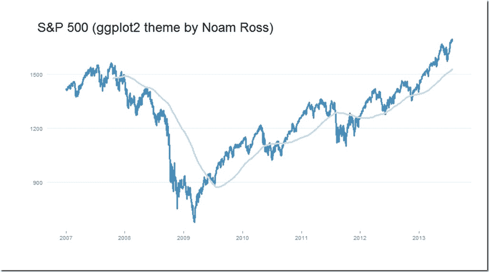

<!--yml

分类：未分类

日期：2024-05-18 14:58:52

-->

# 及时投资组合：使用 Noam Ross 主题的 ggplot2

> 来源：[`timelyportfolio.blogspot.com/2013/07/ggplot2-with-noam-ross-theme.html#0001-01-01`](http://timelyportfolio.blogspot.com/2013/07/ggplot2-with-noam-ross-theme.html#0001-01-01)

当我第一次看到 Noam Ross 的博客文章["超分散感染效应的零模型"](http://www.noamross.net/blog/2013/6/12/multi-infection-overdispersed.html)时，我立刻喜欢上了他用 ggplot2 制作的图表样式。当我发现他把自己的主题放在了[github](https://github.com/noamross/noamtools/blob/master/R/theme_nr.R)上时，我感到更加高兴。尽管我一直在使用[rCharts](http://rcharts.io/site)，但我仍然喜欢漂亮的、符合出版质量的 R 图形。

下面是一些代码，用于将 Noam Ross 的主题与`autoplot.zoo`结合，这样使用 ggplot2 绘制`xts/zoo`对象就会变得容易。

```
require(ggplot2)
require(grid)
require(RColorBrewer)
require(quantmod)

# get closing values for S&P 500 from Yahoo! Finance
sp500 <- getSymbols("^GSPC", auto.assign = FALSE)[, 4] 
```

```
 sp500$ma <- runMean(sp500, n = 200)

colnames(sp500) <- c("S&P500", "200d Mov Avg")

# get noam ross ggplot2 theme from github
source("https://raw.github.com/noamross/noamtools/master/R/theme_nr.R")
# for some reason on my computer panel.background still shows up gray this
# fixes it but might not be necessary for others
theme_nr <- theme_nr() + theme(panel.background = element_rect(fill = "white")) + 
    theme(plot.title = element_text(size = rel(2), hjust = -0.05, vjust = -0.3)) + 
    theme(plot.margin = unit(c(1, 1, 2, 1), "cm"))

autoplot(sp500, facets = NULL) + theme_nr + theme(legend.position = "none") + 
    scale_colour_manual(values = brewer.pal("Blues", n = 9)[c(6, 3)]) + geom_line(size = 1.15) + 
    xlab(NULL) + ggtitle("S&P 500 (ggplot2 theme by Noam Ross)") 
```

它并不完美，但我认为它为我们提供了一个非常好的起点。直接使用 ggplot2 会让我们对那些令人烦恼的细节有更多的控制权。

](https://blogger.googleusercontent.com/img/b/R29vZ2xl/AVvXsEgixo28DNw_eE8thwbgimJVbxa5H5VoSW6cS622m24Mcr6zFchKXSFXPwBWRf3KO-xJw_WYVnJdaKSymuivNJ1P2BAlN7Tzq7mngBTF2egFHc_Lx5dOHH_OAv8kgU03CEmSq3jHw6y3DA/s1600-h/Rplot%25255B1%25255D.jpg)
