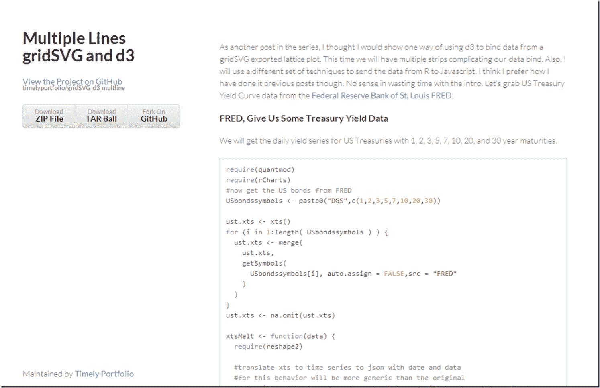

<!--yml

分类：未分类

日期：2024-05-18 14:57:55

-->

# 及时投资组合：使用 d3 的 gridSVG 多行数据绑定——美国国债收益率

> 来源：[`timelyportfolio.blogspot.com/2013/08/gridsvg-multi-line-data-bind-with-d3us.html#0001-01-01`](http://timelyportfolio.blogspot.com/2013/08/gridsvg-multi-line-data-bind-with-d3us.html#0001-01-01)

*如果你还没有阅读关于 gridSVG 和 d3 的其他[帖子](http://timelyportfolio.blogspot.com/search/label/gridSVG)，我建议在阅读这个帖子之前先阅读那些帖子。*

格子或条纹是格网和 ggplot2 我最喜欢的特性之一，因此我当然想要将我们的 d3 反向数据绑定扩展到支持这些小多倍数。让我们看看完成这一目标的其中一种方法。要了解这个过程的简要说明，请点击[这里](http://timelyportfolio.github.io/gridSVG_d3_multline/d3mult_line.html)或下面的截图。如果你只是喜欢收益率曲线数据，我认为你将会喜欢我嵌入下面的图表。

(http://timelyportfolio.github.io/gridSVG_d3_multline/d3mult_line.html)
