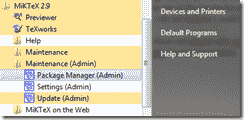
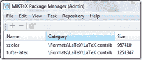

<!--yml

类别：未分类

日期：2024-05-18 15:07:40

-->

# 及时投资组合：knitr 性能报告-尝试 1

> 来源：[`timelyportfolio.blogspot.com/2012/04/knitr-performance-report-attempt-1.html#0001-01-01`](http://timelyportfolio.blogspot.com/2012/04/knitr-performance-report-attempt-1.html#0001-01-01)

我对新的 R 包非常兴奋，但很少有像[knitr](http://yihui.name/knitr/)这样让我兴奋满足。即使没有技能，我已经能够将谢益辉在他的[**knitr 图形手册**](http://yihui.name/knitr/demo/graphics/)中提供的例子适应成一个粗糙的第一版性能报告，我实际上可以给客户和潜在客户展示。尽管这远非生产质量，两天实验已经让我到一个水平，我相信现有令人惊叹的 R 包与 knitr 相结合的巨大潜力。在 knitr 之前，我不相信我能完成甚至这个粗糙的第一稿。

如果你之前没有玩过[MiKTeX](http://www.miktex.org/)，你需要使用包管理器来安装这个例子正常工作的 xcolor 和 tufte-handout 模板。MiKTeX 随[LyX](http://www.lyx.org)自动安装，如昨天帖子[Latex 过敏通过 knitr 治愈](http://timelyportfolio.blogspot.com/2012/04/latex-allergy-cured-by-knitr.html)中讨论。如果 xcolor 引起问题，那么只需将你的仓库改为另一个仓库。

(https://blogger.googleusercontent.com/img/b/R29vZ2xl/AVvXsEjJPtpTFiNVdtQOcP6-OLC_RRJU3b1IGsnP9u9iwZcgzXs2XI04ENJmPK_0t-_KxmN1B8QYWcnB5aRy2DmVYMNFnxftU9PU9bvlfj4rulUkPF0YYODJ996s9da-lbCKzPqYt9gp3xRIVw/s1600-h/image%25255B2%25255D.png) (https://blogger.googleusercontent.com/img/b/R29vZ2xl/AVvXsEhdOKdFBnOKmchEHuJOehbMO0HnYpWr1OEh3Ai3oMFtlTltb5fiX3Kjb0tsU83onigoJmu6nlEcMFWIYas0lL_SA-ZNA_MEMMs79g_Q7JTPszB4W4yUTvCVzj2UNqldQ8MXGDwHyIhKAA/s1600-h/image%25255B5%25255D.png)

knitr 与一点性能分析、lattice 和 latticeExtra 提供了这个第一稿。一如既往，非常感谢那些使这成为可能的杰出贡献者。

[R 代码在 GIST 中：](https://gist.github.com/2381629)
