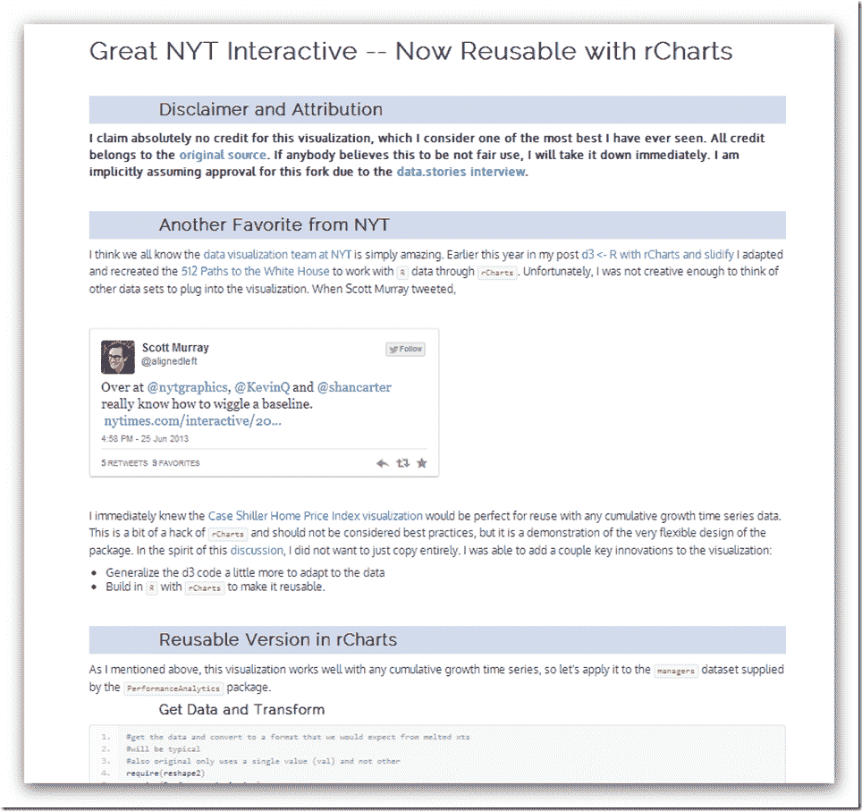

<!--yml

分类：未分类

日期：2024-05-18 14:59:27

-->

# 及时投资组合：rCharts 对纽约时报的重新制作

> 来源：[`timelyportfolio.blogspot.com/2013/06/rcharts-remake-of-nyt.html#0001-01-01`](http://timelyportfolio.blogspot.com/2013/06/rcharts-remake-of-nyt.html#0001-01-01)

那些想知道我是否已经放弃金融的人，答案是否定的。我只是认为在这里除了观察和等待，没有太多可以做的事情。所以，我会继续使用 d3 和 R 来分散自己在市场上做出愚蠢决定的注意力。

这次我使用了[rCharts](http://rcharts.io/site)和[slidify](http://slidify.org)来重新制作[纽约时报的可视化](http://www.nytimes.com/interactive/2011/05/31/business/economy/case-shiller-index.html)，这与我在[白宫之路 512](http://www.nytimes.com/interactive/2012/11/02/us/politics/paths-to-the-white-house.html)中做的一样。现在，我们可以在 R 中构建任何累计增长时间序列，并应用该模板来创建这种惊人的可视化。以下是截图。点击[此处查看活页版本](http://timelyportfolio.github.io/rCharts_nyt_home_price/)。

（[点击查看](http://timelyportfolio.github.io/rCharts_nyt_home_price/)）

在接下来的几天里，我会过上美好的生活，所以直到 7 月 4 日之后才会有新的文章。
