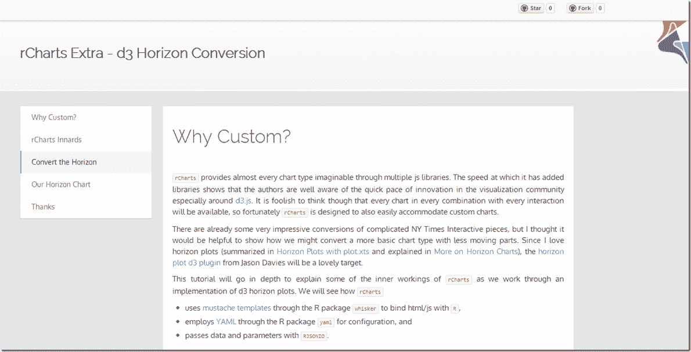

<!--yml

分类：未分类

日期：2024-05-18 14:59:18

-->

# 及时投资组合：rCharts 版本的 d3 水平图

> 来源：[`timelyportfolio.blogspot.com/2013/07/rcharts-version-of-d3-horizon.html#0001-01-01`](http://timelyportfolio.blogspot.com/2013/07/rcharts-version-of-d3-horizon.html#0001-01-01)

我喜欢水平图。我的喜爱在我的博客中[随处可见](http://timelyportfolio.blogspot.com/search/label/horizonplot)，我已经用基础图形、xtsExtra、lattice 和 ggplot2 绘制了水平图表。现在有了[rCharts](http://rcharts.io/site)，我们可以实现[Jason Davies](http://www.jasondavies.com/)的[d3.js](http://d3js.org)水平图表[插件](https://github.com/d3/d3-plugins/tree/master/horizon)来在 html/javascript 中绘制 R 数据。我整理了一个教程，详细介绍了 rCharts 和转换自定义图表。为了教程，请[点击这里](http://timelyportfolio.github.io/rCharts_d3_horizon/)，或者点击下面的屏幕截图。

](http://timelyportfolio.github.io/rCharts_d3_horizon/)
