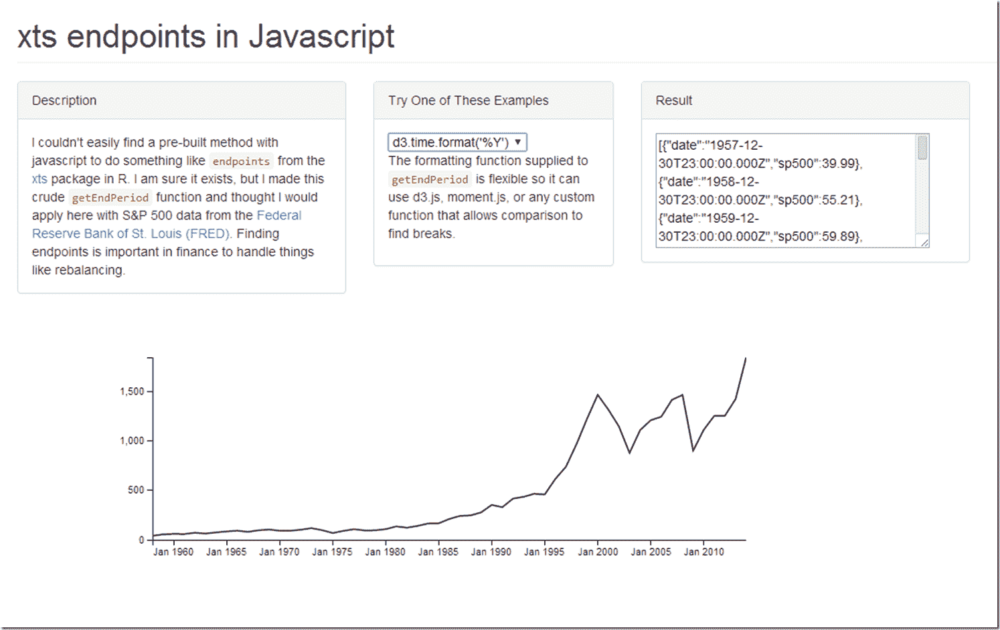

<!--yml

分类：未分类

日期：2024-05-18 14:54:36

-->

# Timely Portfolio: JavaScript 中的 xts 类似端点

> 来源：[`timelyportfolio.blogspot.com/2014/04/xts-like-endpoints-in-javascript.html#0001-01-01`](http://timelyportfolio.blogspot.com/2014/04/xts-like-endpoints-in-javascript.html#0001-01-01)

我决定把这从一条推特评论提升为博客文章。我本想做一个原型 JavaScript 交互式再平衡可视化，来解决[再平衡的未解之谜](http://timelyportfolio.blogspot.com/2014/02/unsolved-mysteries-of-rebalancing.html)，但现在我还没有时间，所以我将其以当前状态释放到野外。我希望有人能使用它。

](http://timelyportfolio.github.io/javascript_date/)
