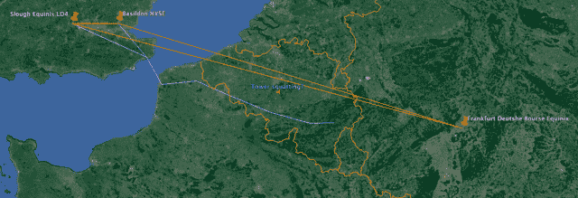

<!--yml

类别：未分类

日期：2024-05-18 14:20:29

-->

# 塔占位——Sniper In Mahwah &朋友们

> 来源：[`sniperinmahwah.wordpress.com/2014/07/26/tower-squatting/#0001-01-01`](https://sniperinmahwah.wordpress.com/2014/07/26/tower-squatting/#0001-01-01)

由于我了解到（感谢[Bloomberg](http://www.bloomberg.com/news/2014-07-15/wall-street-grabs-nato-towers-in-traders-speed-of-light-quest.html)的报道），我居住的国家（比利时）对于高频交易微波塔来说是一个非常有趣的地方（比利时位于伦敦-法兰克福网络的中心），我正在制作一份利用无线电塔将数据从伦敦传输到法兰克福的不同路径的地图。我将在下周发布一份详细的地图。与此同时，这是我重建的一条路径（紫色表示），高频交易员在使用，但由一家科技公司拥有并租给他们网络。还有一座塔没有包括在网络中。这是行业中所说的“塔占位”吗？

