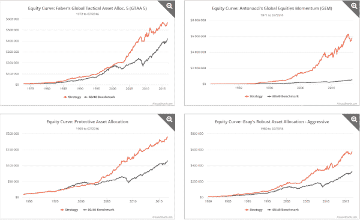

<!--yml

类别：未分类

日期：2024-05-12 17:45:07

-->

# 追踪战术策略的表现 | CSSA

> 来源：[`cssanalytics.wordpress.com/2016/09/08/tracking-the-performance-of-tactical-strategies/#0001-01-01`](https://cssanalytics.wordpress.com/2016/09/08/tracking-the-performance-of-tactical-strategies/#0001-01-01)

有一个[很酷的新网站](https://allocatesmartly.com/)可以追踪知名战术策略的表现。 [AllocateSmartly](https://allocatesmartly.com/) 收集了大量来自知名对冲基金经理如雷·达里奥以及其他几位投资组合经理和金融博主的研究策略。这些策略的回测使用了一种非常详细和全面的方法，既保守又现实。在可能的情况下，作者使用可交易的资产而不是指数和因子，并考虑到交易成本以及对股息的仔细处理。当前的分配和表现实时跟踪，这使得投资者能够现实地交易这些投资组合。有趣的是，今年网站追踪表现最好的模型是 CSSA 的[最小相关算法](https://cssanalytics.wordpress.com/2012/09/12/minimum-correlation-algorithm-mca/)，这充分说明了 2016 年分散投资的重要性相对于动量和通过趋势跟随/时间序列动量管理风险。事实上，如果你更深入地挖掘，你会注意到大多数表现最佳的投资策略都具有结构或动态分散元素。表现最差的投资策略是最集中和致力于识别最佳表现者的。正如网站正确指出的那样——分散投资策略在正常市场条件下通常表现良好，但在熊市中，动态和更战术的策略表现更佳。在较长的回测期间，更真正战术性的策略具有更好的长期表现。不同的市场制度将根据市场的可预测性和相互关联性当年奖励不同的方法。雨伞在暴风雨中很好用，但在晴朗的日子里却不理想。这就是了解你所追随的策略以及你为什么要投资它们而不是盲目追求业绩的重要性，而不是盲目追求业绩。尽管许多量化开发者和投资者追求看起来最好的股票曲线，但重要的是要考虑两个主要因素：1) 对任何一个人来说最有效的效用曲线是一个非常重要的个人选择（即风险/回报和跟踪误差）2) 你需要为资本市场选择一组假设，无论是向前还是长期：回报、相关性或波动性是否可预测，如果可以，哪个最可预测，为什么。

顺便提一下，我被告知非常受欢迎的“[简单战术资产分配策略](https://cssanalytics.wordpress.com/2015/01/26/a-simple-tactical-asset-allocation-portfolio-with-percentile-channels/)”即将加入 AllocateSmartly 网站。这是一种战术和结构多元化的混合策略，在市场下跌时能够降低风险的同时提供平衡的因子风险。虽然它不像更偏向动量或以股权为中心的策略那样收益高，但它能为各种市场状况提供稳定和低风险的配置。

**披露声明：**主要负责准备本材料的作者表达的是他们自己的观点和观点，这些观点可能会随时改变，并且可能与其他在 BSAM 或其关联公司工作的观点或意见不同。提出的任何结论都是假设性的，并不旨在预测任何特定投资策略的未来。本材料基于公开可用的数据，在发布日期之前主要依赖第三方研究和信息，我们并未独立验证。我们不对本材料的准确性或完整性作出任何陈述或保证。仅凭任何图表或图表无法做出明智的投资决策。未来表现的估计基于可能无法实现的前提假设，实际事件可能与假设的事件不同。BSAM 在呈现此材料时不是作为受托人。基准指数仅用于说明目的，并且不考虑投资者所承担的费用和开销的扣除。

本材料中讨论的策略可能不适合所有投资者。我们建议您在做出任何投资决策之前与您的投资顾问交谈。本材料中的信息来源于“最小相关算法策略”文章，该文章是公开可用的，由第三方用于生成 AllocateSmartly.com 上提供的策略和信号。我们未审查且不表示这些信息被准确解释或使用。
