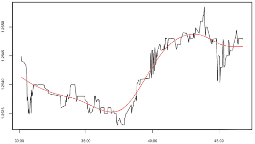
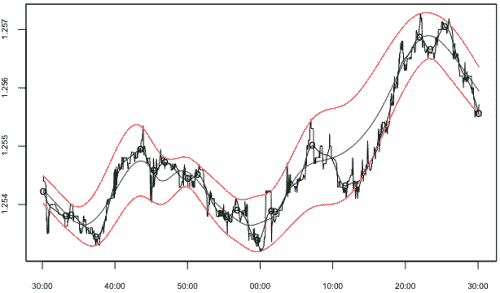

<!--yml

分类：未分类

日期：2024-05-18 15:38:03

-->

# 交易退出策略 | Tr8dr

> 来源：[`tr8dr.wordpress.com/2009/11/10/trade-exit-strategy/#0001-01-01`](https://tr8dr.wordpress.com/2009/11/10/trade-exit-strategy/#0001-01-01)

我并没有过多关注交易退出策略，因为通常依靠交易信号来确定何时扭转头寸（除了各种风险相关参数）。我现在遇到了一个情况，需要独立于信号确定退出。因此，需要根据其他标准做出退出决策。

俗话说：“把损失降到最低，让利润奔跑”。尽管这听起来很简单，但实施起来并不一定简单。任何给定的价格路径都会有“回撤”，即价格不会单调变动。那么如何设置“触发器”以退出交易，使其能够在“回撤”噪音中获得更多利润呢？

**标准做法** 标准做法是使用各种指标来确定何时退出盈利交易：

1.  回撤占“波动性”（最近交易范围）的百分比

    使用最近的交易范围（作为方差的代理）来衡量回撤的数量，在某些条件下可以很好地发挥作用。

1.  任意限制：最大利润，最大交易时间

    我们可能对策略的最大时间或利润机会有一定看法，从而使我们避免在后期遭受亏损来信号我们的退出。

1.  各种技术指标

**一些问题**

在日内交易中，观察市场每一次变动时，上述规则并不适用。高频数据有许多短暂的高幅度波动（相对于典型价格变动而言）。这在交易日中流动性较低的时期尤为明显。

虽然最近的交易范围通常为中低频数据提供了对当前周期噪音水平的合理看法，但对于高频数据通常并非如此。

**最佳方法** 解决这个问题的最佳方法是使用价格路径模型，我们可以确定回撤在向利润方向摆动的概率；或者说，确定在任何重大回撤之前，后续价格行动回撤的概率。这样一个模型不可能始终正确，但成功地完成将比赔率有显著优势。

价格路径模型提供了价格在时间 t 通过某一水平的概率。鉴于这一点可以问：

+   在一段时间内价格通过一个水平的概率是多少

+   在一段时间内价格保持在通道内的概率是多少

上述内容使我们能够根据风险考虑（通道）和可能（或不可能）向正方向移动来做出最佳退出决策。

嵌入在这样一个模型中的是对近期窗口内价格过程的准确看法，这是一个独立的观点和策略。

我为价格路径模型开发了一个通用的校准和预测框架，然而，价格过程的 SDE 需要更多的改进（尽管在某些市场条件下它显示出良好的预测行为，但目前还不能很好地处理所有情况）。短期内是否有更好的替代方案？

**平均回归套利** 除非有半预测的概率模型，否则最好的方法可能是利用我们最近开发的平均回归 envelop。Envelop 可以根据不同的周期和振幅进行调整。

噪声表现出来的是围绕某个演变平均值的平均回归过程。我们可以调整 envelop 来包含我们想要忽略的噪声水平。因此，预计的平均值指示了价格的平均方向。我们可以使用这个信息来判断是否在回调中继续持仓。

