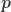
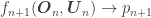

<!--yml

category: 未分类

date: 2024-05-18 13:53:55

-->

# 交易不可观察的变量 | Quantivity

> 来源：[`quantivity.wordpress.com/2010/02/15/trading-the-unobservable/#0001-01-01`](https://quantivity.wordpress.com/2010/02/15/trading-the-unobservable/#0001-01-01)

证券价格受多种因素和约束的影响，其中许多既不是交易者直接可观察到的，也不是可量化的。例如基本面（*例如* 公司行动），行为（*例如* 从众心理），金融（*例如* 流动性），宏观（*例如* 央行干预）和微观结构（*例如* 市场影响算法）。然而，许多经典量化模型仅使用直接观察到的变量进行构建：报价，交易，价格，成交量，价差，*等等*。

*这是一个奇怪的矛盾*。

揭示这一矛盾是探索[市场形态](https://quantivity.wordpress.com/2009/12/31/market-regime-trading-redux/)的核心，因为它们不受可观察变量的特征所限制。

通过一点数学直觉的简短绕道，可以帮助阐明这一矛盾，并指出在经典时间序列统计中找不到的潜在解决方案。考虑任何刻度时间的证券价格：

换句话说，时间为时的证券价格由一些函数决定，该函数是在前一时段期间评估的观察（）和未观察（）变量的函数。诚然，这是一个明显的[重言](http://en.wikipedia.org/wiki/Tautology_%28rhetoric%29)。然而，从这个简单的等价性中，我们可以突出传统时间序列量化模型所施加的 *先验* 约束条件：

+   概率性：未来不能被确定地预测，因此被假定为概率性的，通常从单一分布中绘制（通常是可解析的）

+   [独立同分布](http://en.wikipedia.org/wiki/Independent_and_identically-distributed_random_variables)（i.i.d）：的值是从中绘制的，并且被假定为独立同分布的。

+   观测性：不可观察的变量被排除在外（因为它们无法量化），因此被省略（*即* 空集）

+   统计显著性：[统计显著性](http://en.wikipedia.org/wiki/Statistical_significance)的实现需要一定数量的观察值，因此  通常假设对于长连续序列的  是相同的，如果不是所有的  (*即* )

这些问题由于两个不幸的事实而进一步复杂化：

+   未知 ：模型不知道真正的函数 ，因为它无法得知

+   缺乏目标函数：没有定量的方法知道如何相对于  改进任何给定的模型，因为  是未知的

在寻求为了盈利的交易而选择一个量化模型优于另一个时，以下方法论问题是什么？

然而，并非一切都失去了。有一个美丽的数学技巧：

![g_{n}(\boldsymbol{O}_{n}) \rightarrow \boldsymbol{Z_{n}}  \\[7px] f_{n+1}(\boldsymbol{O}_{n}, \boldsymbol{Z}_{n}) \rightarrow p_{n+1}](img/8fd2effbcfd1fcd9cf2b5a3f70f03461.png)

其中  是*未观察到的变量*（通常在[状态空间](http://en.wikipedia.org/wiki/State_space_%28controls%29)中估计）并且系统用贝叶斯推断来评估。

这个技巧在概念上很简单，但在多种优雅的方式中表现出来，从[隐马尔可夫模型](http://en.wikipedia.org/wiki/Hidden_Markov_Models)和[主成分分析](http://en.wikipedia.org/wiki/Principal_component_analysis)到[卡尔曼](http://en.wikipedia.org/wiki/Kalman_filter) / [粒子](http://en.wikipedia.org/wiki/Particle_filter)滤波器和[状态空间模型](http://en.wikipedia.org/wiki/State_space_%28controls%29)。实际上，机器学习（http://en.wikipedia.org/wiki/Machine_learning）的新兴学科正在寻求统一它们。

然而，机器学习（ML）对许多交易者来说仍然笼罩在神秘和相应的魅力之中。尽管可能有众多原因，两个似乎经常突出：

或者，正如[Gappy](http://www.twitter.com/gappy3000)在最近一篇[评论](https://quantivity.wordpress.com/2010/01/10/how-to-learn-algorithmic-trading/#comments)中简洁地总结的：许多现代量化交易技术：

> “花太多时间学习如何正确应用这些概念，而且很容易误用它们。”

鉴于对[市场体制](https://quantivity.wordpress.com/2009/12/31/market-regime-trading-redux/)的理解部分依赖于对不可观测事物的量化，接下来的系列文章将探讨精选的机器学习技术。受到上述讨论的启发，本系列的第一篇文章将介绍两种优雅且无处不在的机器学习“工作马”：期望最大化法和克吕格-勒伊伯散度。
