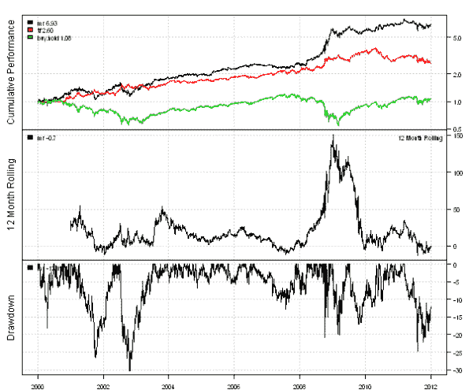
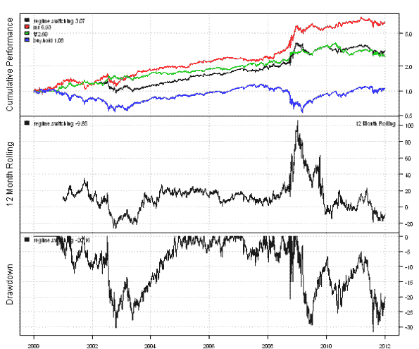

<!--yml

分类：未分类

日期：2024-05-18 14:44:03

-->

# 使用 Garch 波动率预测进行交易 | 系统投资者

> 来源：[`systematicinvestor.wordpress.com/2012/01/06/trading-using-garch-volatility-forecast/#0001-01-01`](https://systematicinvestor.wordpress.com/2012/01/06/trading-using-garch-volatility-forecast/#0001-01-01)

量子金融家（[Quantum Financier](http://quantumfinancier.wordpress.com)）撰写了一篇有趣的文章[使用波动率预测的政权切换系统](http://quantumfinancier.wordpress.com/2010/08/27/regime-switching-system-using-volatility-forecast/)。文章提出了一种基于市场波动在均值回归和趋势跟踪策略之间切换的精巧算法。研究了两个模型：一个使用历史波动率，另一个使用 Garch(1,1)波动率预测。均值回归策略使用 RSI(2)建模：当 RSI(2)时做多，否则做空。趋势跟踪策略使用 SMA 50/200 交叉建模：当 SMA(50) > SMA(200)时做多，否则做空。

我想展示如何使用[Systematic Investor Toolbox](https://systematicinvestor.wordpress.com/systematic-investor-toolbox/)中的回测库实现这些想法。

以下代码从雅虎财经加载历史价格，并使用[Systematic Investor Toolbox](https://systematicinvestor.wordpress.com/systematic-investor-toolbox/)中的回测库比较买入持有、均值回归和趋势跟踪策略的表现：

```

###############################################################################
# Load Systematic Investor Toolbox (SIT)
###############################################################################
con = gzcon(url('http://www.systematicportfolio.com/sit.gz', 'rb'))
    source(con)
close(con)

	#*****************************************************************
	# Load historical data
	#****************************************************************** 
	load.packages('quantmod')	
	tickers = 'SPY'

	data <- new.env()
	getSymbols(tickers, src = 'yahoo', from = '1970-01-01', env = data, auto.assign = T)
		for(i in ls(data)) data[[i]] = adjustOHLC(data[[i]], use.Adjusted=T)		
	bt.prep(data, align='remove.na', dates='2000::2012')

	#*****************************************************************
	# Code Strategies
	#****************************************************************** 
	prices = data$prices  
	n = len(tickers)  
	nperiods = nrow(prices)

	# Buy & Hold	
	data$weight[] = 1
	buy.hold = bt.run(data)	

	# Mean-Reversion(MR) strategy - RSI2
	rsi2 = bt.apply.matrix(prices, RSI, 2)
	data$weight[] = NA
		data$weight[] = iif(rsi2 < 50, 1, -1)	
		capital = 100000
		data$weight[] = (capital / prices) * bt.exrem(data$weight)
	mr = bt.run(data, type='share', capital=capital, trade.summary=T)

	# Trend Following(TF) strategy - MA 50/200 crossover
	sma.short = bt.apply.matrix(prices, SMA, 50)
	sma.long = bt.apply.matrix(prices, SMA, 200)
	data$weight[] = NA
		data$weight[] = iif(sma.short > sma.long, 1, -1)
		capital = 100000
		data$weight[] = (capital / prices) * bt.exrem(data$weight)
	tf = bt.run(data, type='share', capital=capital, trade.summary=T)

	#*****************************************************************
	# Create Report
	#****************************************************************** 
	plotbt.custom.report.part1(mr, tf, buy.hold)

```



接下来，让我们创建一个基于历史市场波动在均值回归和趋势跟踪策略之间切换的策略。

```

	#*****************************************************************
	# Regime Switching based on historical market volatility
	# Classify current volatility by percentile using a 252 day look-back period
	# percentrank(MA(percentrank(Stdev( diff(log(close)) ,21),252),21),250)
	#****************************************************************** 
	ret.log = bt.apply.matrix(prices, ROC, type='continuous')
	hist.vol = bt.apply.matrix(ret.log, runSD, n = 21)
	vol.rank = percent.rank(SMA(percent.rank(hist.vol, 252), 21), 250)

	# Regime Switching Historical
	data$weight[] = NA
		data$weight[] = iif(vol.rank > 0.5, 
					iif(rsi2 < 50, 1, -1),
					iif(sma.short > sma.long, 1, -1)
				)
		capital = 100000
		data$weight[] = (capital / prices) * bt.exrem(data$weight)
	regime.switching = bt.run(data, type='share', capital=capital, trade.summary=T)

	#*****************************************************************
	# Create Report
	#****************************************************************** 
	plotbt.custom.report.part1(regime.switching, mr, tf, buy.hold)

```



接下来，让我们创建一个 GARCH(1,1)波动率预测。我建议任何想了解 GARCH 是什么或者想复习相关知识的人阅读以下文章：

有几种 R 包可以拟合 GARCH 模型。我将考虑来自 tseries 包的 garch 函数和来自 fGarch 包的 garchFit 函数。tseries 包中的 garch 函数速度快，但不一定总能找到解决方案。而 fGarch 包中的 garchFit 函数较慢，但收敛更为一致。为了展示 garch 函数和 garchFit 函数之间的速度差异，我创建了一个简单的基准：

```

	#*****************************************************************
	# Benchmarking Garch algorithms 
	#****************************************************************** 
	load.packages('tseries,fGarch,rbenchmark')	
	temp = garchSim(n=252)

	test1 <- function() {
		fit1=garch(temp, order = c(1, 1), control = garch.control(trace = F))
	}
	test2 <- function() {
		fit2=garchFit(~ garch(1,1), data = temp, include.mean=FALSE, trace=F)
	}

	benchmark(
		test1(),
		test2(),
		columns=spl('test,replications,elapsed,relative'),
		order='relative',
		replications=100
	)

```

garchFit 函数平均比 garch 函数慢 6 倍。所以，为了预测波动率，我将尝试在 garch 函数能找到解决方案时使用它，否则使用 garchFit 函数。

```

	#*****************************************************************
	# Forecast Volatility using Garch	
	# garch from tseries is fast, but does not consistently converge
	# garchFit from fGarch is slower, but converges consistently
	#****************************************************************** 
	load.packages('tseries,fGarch')	

	# Sigma[t]² = w + a* Sigma[t-1]² + b*r[t-1]²
	garch.predict.one.day <- function(fit, r.last) 
	{
		h.last = tail( fitted(fit)[,1] ,1)			
		sqrt(sum( coef(fit) * c(1,  r.last², h.last²) ))	
	}

	# same as predict( fit, n.ahead=1, doplot=F)[3]
	garchFit.predict.one.day <- function(fit, r.last) 
	{
		h.last = tail(sqrt(fit@h.t), 1)
		sqrt(sum( fit@fit$matcoef[,1] * c(1,  r.last², h.last²) ))
	}

	garch.vol = NA * hist.vol
	for( i in (252+1):nperiods ) {
		temp = as.vector(ret.log[ (i-252+1):i, ])
		r.last =  tail( temp, 1 )

		fit = tryCatch( garch(temp, order = c(1, 1), control = garch.control(trace = F)),
	    				error=function( err ) FALSE, warning=function( warn ) FALSE )

		if( !is.logical( fit ) ) {
			if( i == 252+1 ) garch.vol[1:252] = fitted(fit)[,1]
			garch.vol[i] = garch.predict.one.day(fit, r.last)
		} else {
			fit = tryCatch( garchFit(~ garch(1,1), data = temp, include.mean=FALSE, trace=F),
	    				error=function( err ) FALSE, warning=function( warn ) FALSE )

			if( !is.logical( fit ) ) {
				if( i == 252+1 ) garch.vol[1:252] = sqrt(fit@h.t)
				garch.vol[i] = garchFit.predict.one.day(fit, r.last)
			} 
		}			
		if( i %% 100 == 0) cat(i, '\n')
	}
	garch.vol = ifna.prev(garch.vol)

```

现在，让我们创建一个基于 GARCH(1,1)波动率预测在均值回归和趋势跟踪策略之间切换的策略。

```

	#*****************************************************************
	# Regime Switching using Garch
	#****************************************************************** 		
	vol.rank = percent.rank(SMA(percent.rank(garch.vol, 252), 21), 250)

	# Regime Switching Garch
	data$weight[] = NA
		data$weight[] = iif(vol.rank > 0.5, 
					iif(rsi2 < 50, 1, -1),
					iif(sma.short > sma.long, 1, -1)
				)
		capital = 100000
		data$weight[] = (capital / prices) * bt.exrem(data$weight)
	regime.switching.garch = bt.run(data, type='share', capital=capital, trade.summary=T)	

	#*****************************************************************
	# Create Report
	#****************************************************************** 
	plotbt.custom.report.part1(regime.switching.garch, regime.switching, buy.hold)

```

以下是图片的翻译: 

使用 GARCH(1,1)波动率预测的切换策略略优于使用历史波动率的策略。

有许多不同的方法可以将预测 Incorporate into your models and trading strategies. R has a very rich set of packages to model and forecast time series. Here are some examples that I found interesting:

要查看这个示例的完整源代码，请查看[bt.volatility.garch()函数在 github 上的 bt.test.r](https://github.com/systematicinvestor/SIT/blob/master/R/bt.test.r)。
