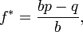

<!--yml

分类：未分类

日期：2024 年 05 月 12 日 18:51:03

-->

# 使用“条件概率”和“凯利准则”进行交易管理 | CSSA

> 来源：[`cssanalytics.wordpress.com/2009/08/07/using-contingent-probabilities-and-the-kelly-criterion-for-trade-management/#0001-01-01`](https://cssanalytics.wordpress.com/2009/08/07/using-contingent-probabilities-and-the-kelly-criterion-for-trade-management/#0001-01-01)

凯利准则实际上是一个隐藏的宝石，主要是因为它直接与现代投资组合理论（MPT）的均值方差效用框架相矛盾。现代金融的高级祭司们压制了这个实用的决策工具，以保护他们自己的利益，这是好事——因为它给了你竞争对手的优势。

凯利准则的目的是最大化复利回报，同时保持破产的概率为零。最初，它被用于 21 点玩家确定计数卡时要下注多少。当计数高时，他们会有更高的期望，并下更多的赌注。但下注的金额至关重要，因为实际上，计数卡者的优势实际上相当小。它可以在玩家和庄家之间变化为 52/48，当牌堆装满十和 A 时，可能会变为 55/45（取决于牌堆数量、21 点赔率等）。具有讽刺意味的是，股票市场每日跟进的赔率（在下跌后押注上涨日，反之亦然）几乎相同，而赔率要比每天加倍下注小得多。凯利准则如下：

对于两个结果的简单下注，一个涉及输掉下注的全部金额，另一个涉及赢得下注金额乘以赔率的倍数[赔率](https://cssanalytics.wordpress.com/wiki/Odds "Odds")，凯利赌注是（来自 Wikpedia [`en.wikipedia.org/wiki/Kelly_criterion`](http://en.wikipedia.org/wiki/Kelly_criterion)）：

其中

+   *f** 是当前资金的一部分，用于下注的比例；

+   *b* 是下注所得的净赔率（即，赔率通常被引用为“*b*比 1”）

+   *p* 是获胜的概率；

+   *q* 是失败的概率，即 1 − *p*。

请注意，在将凯利准则应用于市场时一个重要的难题是，它是在假设如果你输掉整个赌注就丢失的情况下设计的。从这种角度来看，它可以直接应用于期权，但必须进行修改以实际使用。理论上，投资标普 500 指数明天永远不可能输掉所有的钱。在我进入条件概率之前，让我们讨论一下我喜欢如何进行这种修改。首先，我把市场分为两种状态：1) 牛市 2) 熊市。我通过确定 252 天平均值是否上升来确定这一点，即如果标普 500 的 252 天平均价格高于前一天，我们处于牛市。如果平均值正在下降，我们处于熊市。我为每个状态计算平均每日价格回报和赢与输的概率。以下是过去 4000 根标普 500(SPY)柱状图的结果：

|  | 正面百分比 | ADR* |
| --- | --- | --- |
| 牛市（1 年期上升移动平均） | 53.50% | 0.05% |
| 熊市（1 年期下降移动平均） | 51.76% | -0.02% |
| 平均每日回报率 |  |  |

我假设在熊市中你将以做空为基准，而在牛市中做多。请注意，在熊市中，你需要将（1-51.76%）=48.24%作为你的赢率，和-1*.02%= .02%作为你的平均利润。现在我们需要看看平均赢利与平均亏损之间的比较：

|  | 平均赢利 | 平均亏损 | 净赔率 |
| --- | --- | --- | --- |
| 牛市（1 年期上升移动平均） | 0.70% | -0.70% | 1.00 |
| 熊市（1 年期下降移动平均） | 1.34% | -1.21% | 1.11 |

从这里我们可以开始计算股票市场的修改凯利公式——让我们称它为 MDVK，因为我以我的缩略词的慎重使用/滥用而闻名。

***B***= ***T ***x *20/(当前 VIX 水平)*

***MDVK***= (B x 1/2 x (100/(1-凯利准则)))*max(300%)*

其中**T**= *在牛市中做多/在熊市中做空的 100%趋势赌注*

其中**B**= *在牛市中做多/在熊市中做空的基准赌注*

我们的标准开盘赌注***T***基本上是在长期趋势方向上做多 100%乘以相对 VIX（波动指数）水平。这是在假设长期 VIX 为 20 的情况下规范我们的赌注。它还迫使我们在熊市中下注更少，因为它们本质上是更具波动性的。2008 年 10 月当 VIX 为 80 时，你的赌注只能是组合的 25%（20/80）。本质上***B***通过 1)迫使我们跟随长期趋势下注，从而避免肥尾效应 2)规范我们的赌注大小，使我们能够使用相同的“赌注”，从而最小化任何单一坏赌注的影响。

在 MDVK 中的公式可以这样解释：1/2 代表我们下注的是正常凯利推荐的一半。这是由于股市中的真实概率是未知的，而在扑克或黑杰克中它们是确切的。这避免了过度下注的问题，使用 1/2 的调整通常是最优的。这个系统非常保守，但它主要是为了在强优势不存在时最小化下注额。回到方程，100/(1-kelly)表示我们需要考虑到我们不会在一次投注中损失 100%的赌注。请注意 MDVK 已经调整，最大分配是 300%——在我看来，这不应该超过，以避免通过罕见事件 crippling 账户。在上述例子中，假设没有其他信息，MDVK 的计算如下：

场景 1) 假设市场熊市，VIX 为 30：

对于凯利准则：净赔率=1.1   获胜概率=48% 失败概率=52%

f = (1.1*.48-.52)/1.1 = .73%

MDVK= 20/30*.5*(100%-.73%) or .6666*.5*.96= **31%**

因此，我们的最佳下注额是 31%的资本。

对于牛市：

场景 2) 假设市场牛市，VIX 为 20：

对于凯利准则：净赔率=1   获胜概率=53.5% 失败概率=46.5%

f= (1*53.5%-47.5%)/1= 6%

MDVK=20/20*.5*(100%-6%) or .5*(94%)= 47%

因此，在场景 1 的牛市中，我们的最佳分配是 47%——这是一个非常保守的分配，完整的凯利准则会要求投资 94%，但这在强额外的优势下几乎没有余地增加下注额。这是使用条件分析进行改进的主题，将在周末完成。
