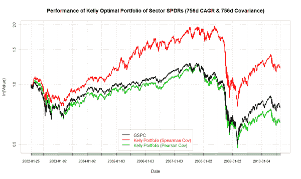
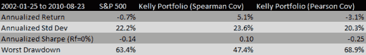

<!--yml

类别：未分类

日期：2024-05-12 18:19:04

-->

# 使用非参数统计学改进投资组合优化 | CSSA

> 来源：[`cssanalytics.wordpress.com/2010/09/08/using-non-parametric-statistics-to-improve-portfolio-optimization/#0001-01-01`](https://cssanalytics.wordpress.com/2010/09/08/using-non-parametric-statistics-to-improve-portfolio-optimization/#0001-01-01)

**David Varadi 和 Henry Bee**

金融市场是嘈杂的，并不遵循高斯分布，也不整齐地符合使用线性回归分析。这是因为缺乏稳定性以及与数据中潜在关系相比有相当大的噪声。因此，传统做法是使用经典统计学和线性优化方法进行投资组合分配或指标，这是很奇怪的。这一点在博客上已经强调了很多次，我再怎么强调也不为过：在处理金融数据时，你需要尽可能少地做出假设，以创建有用的工具或应用程序。这意味着你应该使用百分位数/直方图和其他非参数统计学作为你分析的基础。像现代投资组合理论和 CAPM 这样，以数学证明为基础来分配资本，是荒谬的。然而，在现实世界的资产管理中，这却是标准做法——因此金融公司低估风险并“崩溃”也就不足为奇了。在其他行业，解决复杂问题的方法更加实用。军队并不依赖固定的方程式来引导导弹击中目标，否则它们将会非常不准确。有太多像风、压力和温度这样的变量需要考虑，使得固定解决方案不切实际。允许使用非线性统计学，并通过递归来提高估计的精度，对于各种形式的现代“火箭科学”来说绝对是必不可少的。分配资本为什么会有所不同呢？

投资组合优化之外的一个弱点是纳入计算中的输入数据。相关系数是主要罪魁祸首之一，因为它在两个变量之间存在线性关系时最为有效。任何有在金融市场数据上运行回归经验的人都会理解，强线性关系是寥寥无几的。通常表示金融关系的点簇在某些区域比其他区域更密集，而且这种关系往往具有非线性特征。衡量这种相关性的最佳方法是使用非参数变体，即斯皮尔曼相关系数[`en.wikipedia.org/wiki/Spearman’s_rank_correlation_coefficient`](http://en.wikipedia.org/wiki/Spearman's_rank_correlation_coefficient) 。斯皮尔曼相关系数实际上使用排名而不是原始数据来判断关系。这使得实际关系可以是任何形状，但如果它是系统性的，那么系数将会很高——就像普通的的相关系数一样。

为了测试这个假设，我们研究了各种不同的分配练习，包括不同的资产以及个别交易策略。在此案例中，我们使用协方差矩阵和 9 个组成标普 500 的 sector ETFs（SPYDERS）的回报进行了凯利投资组合优化。对于那些曾经使用过 SPYDERS 的人来说，它们是非常嘈杂的，并且不会产生许多系统性效应。我们选择了 3 年窗口（756 天）的协方差和 CAGR 输入，这对于长期投资组合分配是典型的，同时对于策略分配（如 RSI2，移动平均线等）也是有帮助的。在不同的参数和分配练习中，斯皮尔曼相关系数始终优于传统的皮尔逊相关系数。

**图 1**：*斯皮尔曼协方差可以显著提高结果。*

图(https://cssanalytics.files.wordpress.com/2010/09/sector_756cagr_756spearman_pearson.png)

下面是一个性能摘要，显示斯皮尔曼协方差在投资组合分配练习中非常有用。使用如 252 天短期回溯的 CAGR 和 60 天的相关性得出了同样的结论。在其他资产类别以及策略分配上的结果更为明显。虽然斯皮尔曼本身可以大幅改进，但就其基本形式而言，它是一个很好的改进。正如烹饪中所说——“改进经典食谱的全部所需只是更优质的食材。”CSS 已经进行了大量研究，以创造经典投资组合分配输入的高级版本——期待更多内容。

图(https://cssanalytics.files.wordpress.com/2010/09/sector_kelly_summary_table.png)
