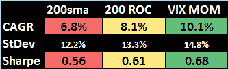
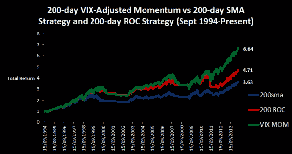

<!--yml

类别：未分类

日期：2024-05-12 17:53:02

-->

# VIX-Adjusted Momentum | CSSA

> 来源：[`cssanalytics.wordpress.com/2014/07/29/vix-adjusted-momentum/#0001-01-01`](https://cssanalytics.wordpress.com/2014/07/29/vix-adjusted-momentum/#0001-01-01)

许多看似简单的策略中加入许多小细节可以产生很大的不同。我经常喜欢用烹饪的类比，所以我喜欢把番茄酱看作是一个经典例子：它的配料很少，制作简单，但若不理解各成分之间的相互作用，则难以掌握。趋势跟随策略也不过如此：任何人都可以创建一个简单的策略，很少有人能掌握其细微之处。在衡量金融市场数据中的趋势时，一个问题是方差不是恒定的。在统计学中，我们知道异方差性[(heteroscedacity)](http://en.wikipedia.org/wiki/Heteroscedasticity)可以使传统回归分析变得没有意义。因此，在与移动平均策略结合使用未调整的价格数据，甚至简单地采用复合回报或 ROC（变化率）都可能导致潜在的时机决策失误并增加交易的频率。

好消息是，在金融市场中，波动性是可以高度预测的。或许，最好的波动性衡量指标就是市场参与者反映在 VIX 中的隐含波动性。一个简单的想法就是使用 VIX 来调整日回报率，以创建一个对非恒定方差更具鲁棒性的趋势跟随策略。以下方法非常简单：

1) 计算 S&P500 时间序列的日回报率或对数回报率

2) 将每日的回报率除以当天的 VIX 水平

3) 选择一个滞后期，并计算简单平均数——例如在这个例子中是 200 天

策略：当 VIX 调整动量>0 时做多，如果 sma 则持现金，否则做空）以及一个 200 天的传统动量策略（当 ROC>0 时做多，否则持现金）。

以下是策略比较的图表：

显然，VIX 调整后的动量优于使用这一组参数的传统趋势跟随策略。这个概念可以通过几种不同的方式进行扩展——例如，一个人可以相反地使用历史波动性，或者在创造性的方式下使用历史和隐含之间的差异。希望读者能受到启发，重新审视并改进一个简单且传统的策略。
