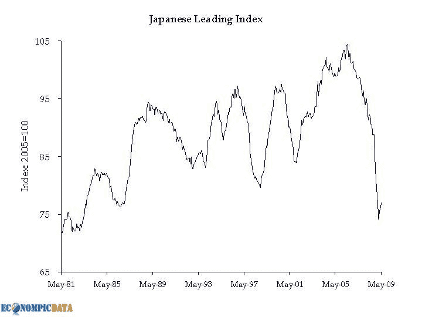

<!--yml

分类：未分类

日期：2024-05-18 17:40:02

-->

# VIX and More: “Darn Nice Economic Eye Candy”

> 来源：[`vixandmore.blogspot.com/2009/07/darn-nice-economic-eye-candy.html#0001-01-01`](http://vixandmore.blogspot.com/2009/07/darn-nice-economic-eye-candy.html#0001-01-01)

最近，似乎每一项新的经济数据都要被从十个不同的角度仔细审查，以寻找经济复苏的迹象，或是萎缩、触底、反弹和回落的迹象。更糟糕的是，还有头条数字、剔除了某些因素的数据子集、月度对比、年度对比以及与市场共识预测相比的对比——取决于你听谁的，甚至可能有多达几个“共识”数字。

幸运的是，博客圈内有几家优秀的网站，它们能够迅速将每一项新的经济数据提炼成一些关键图表。这些网站中的一些佼佼者，如[Calculated Risk](http://www.calculatedriskblog.com/)、[The Big Picture](http://www.ritholtz.com/blog/)等，都是广为人知的。其他一些博客对数据进行剖析，并以图形方式重新包装亮点，也应该更加为人所知。这其中的一个网站是[EconomPicData](http://econompicdata.blogspot.com/)，它负责下面的图表。

以下是今晨彭博社的一条新闻报道，标题为[日本银行表示所有 9 个地区的经济衰退都在缓解](http://bloomberg.com/apps/news?pid=20601068&sid=ap36WVfaS47U)的开头部分：

> **自 2006 年 1 月以来，日本银行首次对所有九个地区的经济持乐观态度，行长白川方明表示出口和工业生产正在恢复。**
> 
> **“所有地区的经济恶化速度都在减缓，”日本央行在今天东京的一份**[**季度报告**](http://www.boj.or.jp/en/type/ronbun/chiiki_rep/chiiki0907.htm)**中称。**

**EconomPicData 的 Jake 将这种乐观情绪置于**[**更广泛的历史背景**](http://econompicdata.blogspot.com/2009/07/japanese-optimism.html)**中：**

**[图表：EconomPicData]**

的确可能存在进步的迹象，但对我来说，过早地对改善的幅度感到兴奋显然是轻率的。

要获取连续的经济图表和解读，请查看口号为[Darn Nice Economic Eye Candy](http://econompicdata.blogspot.com/)的网站。**
