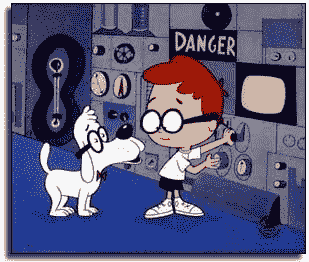

<!--yml

分类：未分类

日期：2024-05-18 15:57:34

-->

# VIX 和更多内容：“让我们看看你们这些混蛋能不能做到 90！”

> 来源：[`vixandmore.blogspot.com/2007/02/lets-see-if-you-bastards-can-do-90.html#0001-01-01`](http://vixandmore.blogspot.com/2007/02/lets-see-if-you-bastards-can-do-90.html#0001-01-01)

大约一个月前，我在[评论](http://vixandmore.blogspot.com/2007/01/apropos-of-recent-discussion-about.html)中提到一些[评论](http://www.thestreet.com/_tscana/markets/activetraderupdate/10334755.html)来自[Doug Kass](http://www.seabreezepartners.net/team.asp)关于市场看起来很像 1994 年，那是一个对股市来说明显的下跌年份。现在 Bernie Schaeffer 告诉我们，WABAC 机器（不要与非常有趣的互联网档案‘[wayback machine](http://www.archive.org/web/web.php)’混淆）实际上应该设置为 1995 年，而不是 1994 年。

当然，差异是显著的。在 1995 年，我们看到了一场辉煌的牛市的开始，一直持续到 2000 年初。那些在 1994 年大量买入多头仓位的人可能在享受 1995 年牛市的成果之前需要先摆脱困境——如果他们在这期间没有完全放弃的话。

在文章“[1995 年市场的相似之处](http://www.schaeffersresearch.com/plus/bgscommentary.aspx?click=home&ID=18434)”中，Schaeffer 提出了与 1995 年牛市初期相似的观点如下：

“Joseph Keating，First American Asset Management 的首席投资策略师，最近在一篇文章中指出，截至 2006 年第三季度，标普 500 的市盈率（P/E）降至 17，这是自 1995 年年中以来的最低水平。与此同时，标普 500 现在已经连续 221 天没有出现 2%的回调。这与 1995 年所经历的 223 天连续 streak 相比较。”

进一步来说，我们发现市场正处于另一个低波动性环境中，因为 CBOE 市场波动指数（VXO）目前徘徊在类似于我们 1995 年所见水平的附近。“

个人而言，我认为这看起来更像 2017 年而不是其他任何年份。如果被迫选择将我的展望与其他任何一年相匹配，我宁愿选择 1994 年而不是 1995 年，但谁知道呢，我只是生活在我自己的小 VIX 中心宇宙里…
