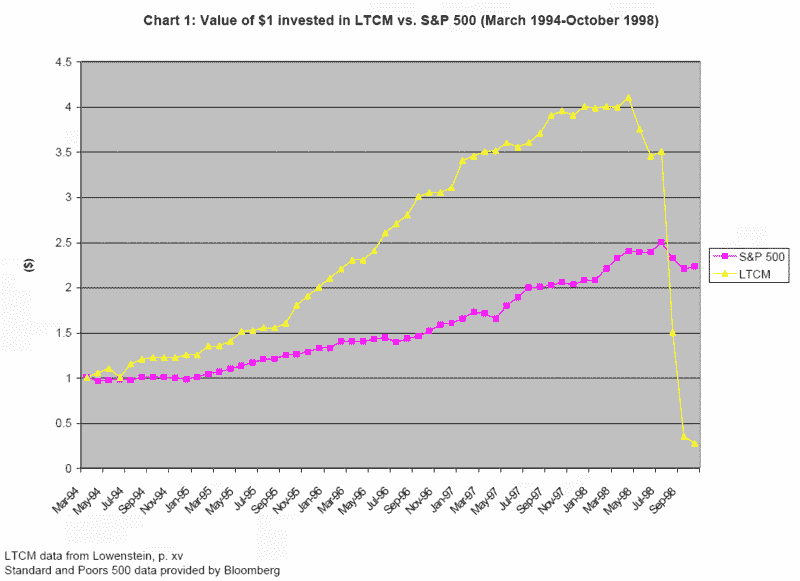

<!--yml

分类：未分类

日期：2024-05-18 19:02:31

-->

# VIX 和更多：2007 年与 1998 年，次贷危机与 LTCM

> 来源：[`vixandmore.blogspot.com/2007/08/2007-vs-1998-or-subprime-vs-ltcm.html#0001-01-01`](http://vixandmore.blogspot.com/2007/08/2007-vs-1998-or-subprime-vs-ltcm.html#0001-01-01)

1998 年在市场上活跃的人和任何市场的学生都应该问自己，当前的次级抵押贷款混乱与九年前的[长期资本管理](http://en.wikipedia.org/wiki/Long-Term_Capital_Management)失败相比如何。

如果你还没有读过罗杰·洛温斯坦的优秀作品[当天才失败时：长期资本管理的崛起与衰落](http://www.amazon.com/When-Genius-Failed-Long-Term-Management/dp/0375758259)，现在阅读也为时不晚。洛温斯坦所记录的事件中，高盛、所罗门和其他人对 LTCM 头寸的无情挤压，这些活动可能与现在幕后发生的一些事情有很强的相似之处。

今天比较的目的是为了对比 LTCM 失败引发的波动规模与我们过去两个月所看到的。请注意，根据洛温斯坦的说法，LTCM 的资本在 1998 年 4 月达到顶峰，如下面来自[西达·普拉布](http://www.econ.duke.edu/dje/2001/prabhu.pdf)的图表所示，他使用了洛温斯坦的数据。

从 1998 年到谷底的 VIX 和 SPX 图表显示，LTCM 从 4 月到 7 月的小额亏损对市场影响非常小，但随着亏损的增加（以及[俄罗斯金融危机](http://en.wikipedia.org/wiki/Russian_financial_crisis)的扩大），VIX 在两个月内几乎翻了两番，而标普 500 指数下跌了约 20%。为了更了解历史背景，请注意，到年底时，SPX 已经收回了所有这些损失并继续上涨，而 VIX 几乎回到了危机前的低点。

当前情况如何呢？再次查看图表底部，VIX 在两个月内几乎翻了两番（一个月内翻一番），而 SPX 的市值损失了近 10%。从比较的角度来看，这意味着当前情况下的恐慌情绪更多，而金融损失较少——至少目前是这样。

随着 LTCM 和[阿玛兰特](http://en.wikipedia.org/wiki/Amaranth_Advisors)已经写入历史，你会认为那些有能力避免类似危机的人会处于更好的位置来这样做。继续关注与 1998 年的比较，不要急于得出这次会比九年前更糟的结论。
