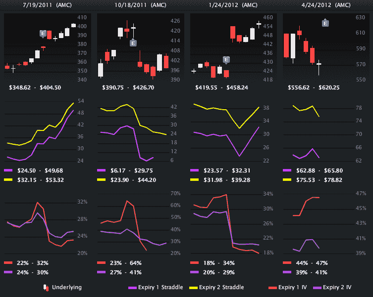
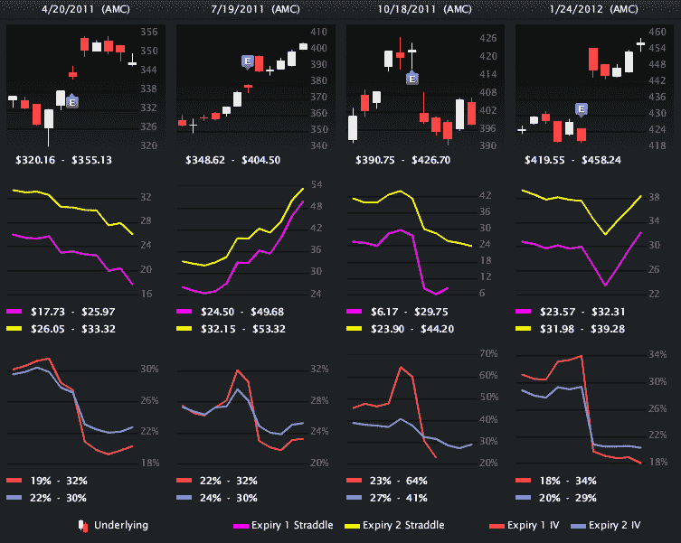
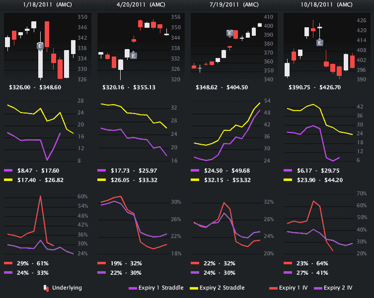
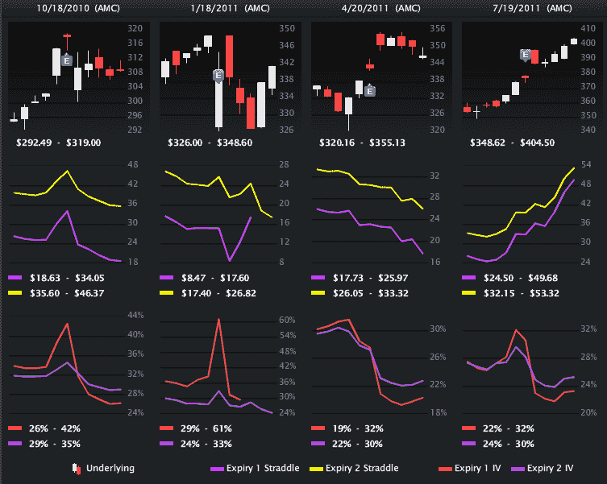
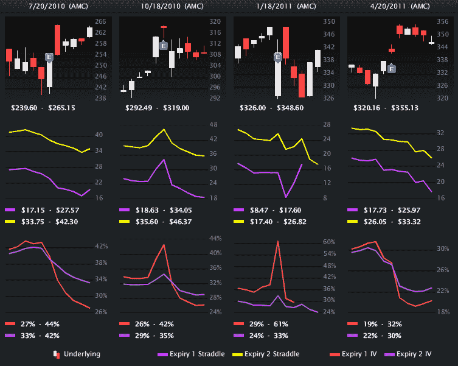

<!--yml

分类：未分类

日期：2024-05-18 16:32:04

-->

# VIX and More: A Brief History of Apple Earnings, in Pictures

> 来源：[`vixandmore.blogspot.com/2012/04/brief-history-of-apple-earnings-in.html#0001-01-01`](http://vixandmore.blogspot.com/2012/04/brief-history-of-apple-earnings-in.html#0001-01-01)

如果一张图片值一千字，那么也许我可以用下面的汇编节省不少键盘输入，甚至可能节省一些推文。

这是一个视觉帖子，所以我将保持我的评论简短，除非特别指出下面的图表源自[LivevolPro.com](http://livevolpro.com/)，并以图形形式展示了从 2010 年 7 月至今的苹果([AAPL](http://vixandmore.blogspot.com/search/label/AAPL))收益情况。

每列代表一个收益报告周期，并包括三个图表和四个收益期：

1.  顶部 K 线图显示了 AAPL 股票价格的十一交易日，收益报告前后五交易日

1.  中间图表显示了 AAPL 期权的当月和第二个月的前瞻性对冲价格（用于确定投资者是否低估或高估了收益报告后的股价变动程度）

1.  底部图表显示了从当月和第二个月 AAPL 期权衍生出的 30 天隐含波动性（类似于现在可从[VXAPL](http://vixandmore.blogspot.com/search/label/VXAPL)获得的内容）

记住，你不必对苹果的收益报告有任何看法，但由于其他人都有，并且市场已经 price in 了，将当前情况放入历史背景中可能会有所帮助。

相关文章：

**

*[来源(s): LivevolPro.com]*

***披露(s):*** *Livevol 是 VIX 和 More 的广告商*
