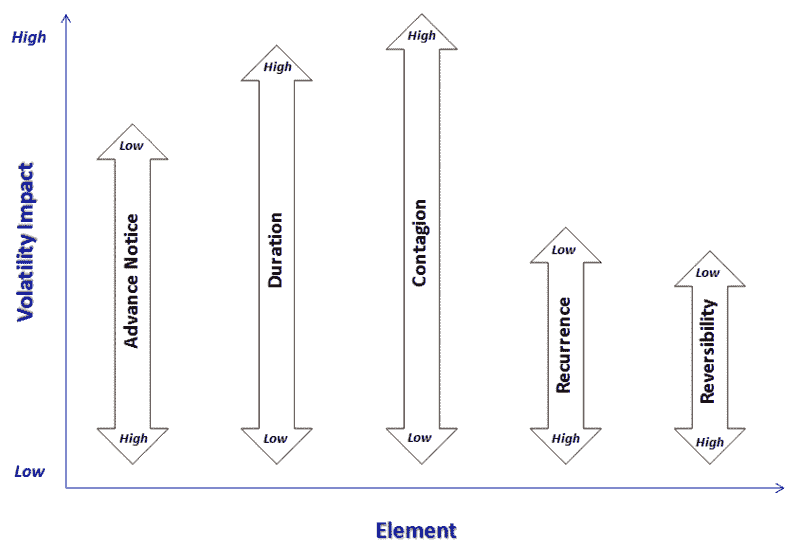

<!--yml

分类：未分类

日期：2024-05-18 18:23:09

-->

# VIX 与更多：波动事件的 conceptual framework

> 来源：[`vixandmore.blogspot.com/2008/10/conceptual-framework-for-volatility.html#0001-01-01`](http://vixandmore.blogspot.com/2008/10/conceptual-framework-for-volatility.html#0001-01-01)

我之前开发了一个帮助思考波动事件的框架，鉴于最近的波动，我认为分享这个框架可能会有所帮助。

首先，影响波动性的事件有许多不同的类型。其中一些事件几乎会根据一个确切的时间表即时发生，即使事实是出人意料的，这个时间表也是*预先知道的*。确切即时波动事件的例子包括政府经济数据（例如，明天每周的[失业救济申请](http://vixandmore.blogspot.com/search/label/jobless%20claims)）、公司盈利公告（例如，雪佛龙（[CVX](http://finance.yahoo.com/q?s=CVX)）明天报告）、以及本·伯南克昨天讲话。其他事件*以模糊的时间表逐步展开*，经历无数曲折。模糊增量事件的例子包括飓风（如 Gustav、Hanna 等）、地缘政治危机（格鲁吉亚/南奥塞梯、伊朗、伊拉克等）和当然，当前的金融危机。

传染性是波动事件的一个重要方面。事件会传播并触发其他相关的高波动事件吗？部门传染性（金融部门中的机构互联）和地理传染性（亚洲金融危机）相对常见，但特定实体问题（例如，安然）通常不会蔓延至整个部门（尽管它们可能暗示一个更广泛的以前未识别的部门问题。）

在这个领域不必过于详细，我将提到概念性框架中的另外两个相关元素：*重复性*和*可逆性*。政府数据报告是重复的和可逆的。生产率和[GDP](http://vixandmore.blogspot.com/search/label/GDP)数字是每季度发布的，并随后进行修订。FOMC 公告和同店销售额数字是重复的，但不会修订。模糊增量波动事件不会以相同形式重复并且不可逆转。然而，法律裁决既不会重复也不会逆转。

这究竟意味着什么？这意味着大多数波动事件可以按照五个维度进行分类，而这些维度可以用来预测特定事件类型对波动的影响程度。

在下面的图表中，我将上述内容精炼为五个维度，并提供了一个思考它们如何影响波动性的框架。因此，高波动性事件通常不会有太多的提前预警（注意箭头顶部的“低” designation，意味着低级别的元素会导致高波动性），持续时间长，涉及高度（或潜在的）传染性，不会是周期性的，也不会是可逆的。此外，传染性因素通常对波动性的影响大于提前预警，而提前预警往往比可逆性等因素更重要。

来源：[VIX 和更多](https://example.org/vix_and_more)

一如既往，我们鼓励提供反馈。
