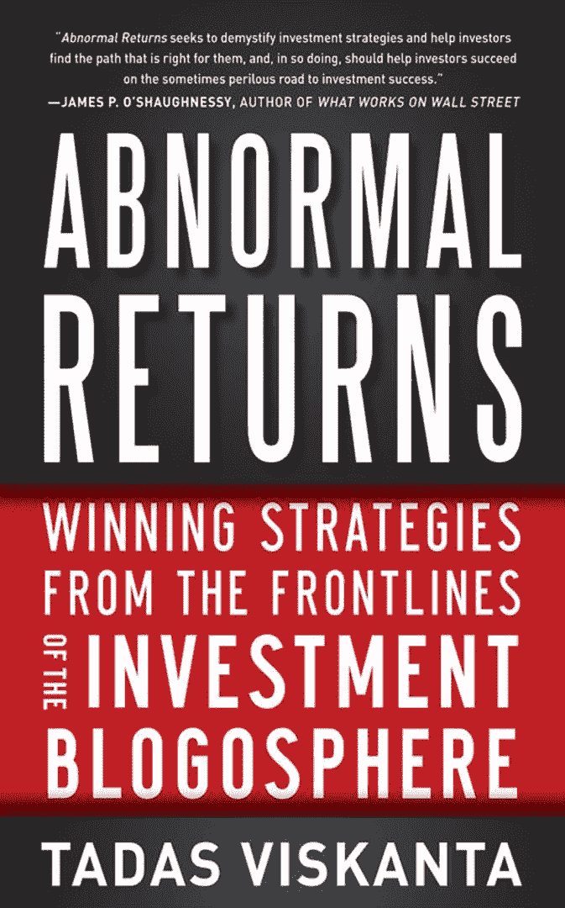

<!--yml

分类：未分类

日期：2024-05-18 16:29:25

-->

# VIX and More: 与 Abnormal Returns 的塔达斯·维斯卡塔的对话

> 来源：[`vixandmore.blogspot.com/2012/05/conversation-with-tadas-viskanta-of.html#0001-01-01`](http://vixandmore.blogspot.com/2012/05/conversation-with-tadas-viskanta-of.html#0001-01-01)

塔达斯·维斯卡塔是[Abnormal Returns 博客](http://abnormalreturns.com/)的创始人、编辑和策展人，投资者来这里发现对他们世界重要和相关的内容，博主们来这里看看他们的努力是否足够吸引人，以至于能被包括在 Abnormal Returns 每天投资者仔细研究的精选链接中。塔达斯拥有芝加哥大学的 MBA 和印第安纳大学的 BA。他的第一本书，《Abnormal Returns: Winning Strategies from the Frontlines of the Investment Blogosphere》，一个多月前由麦格劳-希尔出版，可购买精装版和 Kindle 电子书版。

**我最近有机会与塔达斯谈谈博客、书籍以及与投资相关的许多问题。以下是我们对话的简版。**

**BL：是什么激发你创办博客 Abnormal Returns 的？**

塔达斯·维斯卡塔：我有一个关于对冲基金的书稿，已经被四处推销，但最终没有结果。我一直关注着初生的投资博客场景，而 WordPress.com 刚刚上线，所以我以为这肯定是一个信号。

**BL：当你开始时，你是否有一个成为最佳金融链接目的地网站的愿景，还是这是偶然发生的？**

电视：完全是偶然。我很快意识到我不是最快的博主，其他博主正在做伟大的工作。指向他们的工作似乎比做“我也是”的工作更自然。每个博主都必须找到他们的利基。

**BL：随着时间的推移，你的方法有什么变化？**

塔达斯·维斯卡塔：我只是关注我感兴趣的事情。我在避免政治方面非常谨慎，这意味着我也会避免经济政策问题。这为我腾出了大量的空间（和时间）。我写博客关于正面和规范的博客圈之间的区别。最好的文章专注于数据。我也在快速总结方面变得越来越好。

**BL：为什么 Abnormal Returns 这本书能吸引比 Abnormal Returns 博客更广泛的受众？**

托尼·维奥莱特：这个博客吸引了一些复杂的个人投资者和一些机构投资者。相比之下，这本书试图吸引更广泛的受众。我担心也许我们这些博主没有工具和词汇去吸引广泛的投资者群体。拿一个明显的例子来说，苹果公司把很多复杂性隐藏在技术背后，他们有动机采取这种做法。在金融领域，这些动机迄今为止被忽略了，金融服务公司通过复杂的产品和服务赚钱。先锋平衡基金对投资者来说是一个很棒的基金，但是没有人会因为提供这种类型的建议而赚大钱。

-   巴里·利普舒茨：在改变工具和词汇方面，可以做什么以达到更广泛的投资者受众？

托尼·维奥莱特：ETF 是一个工具，但本身并不是一个解决方案。至于词汇方面，这是一个过程，而不是一次性的事情。我们大家都有类似的目标，处理类似的问题。重要的是要把投资者引导到储蓄和投资的道路上。

-   巴里·利普舒茨：你认为大多数投资者应该关注哪些工具或问题？

托尼·维奥莱特：目标应该是要成为一个高效的投资者。借用网球的一个观点，避免非受迫性失误很重要——特别是要避免可能让你破产的事情。在这方面，三个杀手是杠杆、复杂性和流动性。

-   巴里·利普舒茨：你认为投资者为什么会陷入困境？他们做错了什么？

托尼·维奥莱特：DALBAR 的研究考察了基金流动对业绩的反应方式。通常投资者是在高买低卖。其中一部分与明星经理制度有关。一个例子是比尔·米勒，大多数资金在他基金里的流入时机正好是最糟糕的时候。如果你比较平衡基金，你不会看到那么多“不良行为”。这类基金的关注点似乎更多的是整体投资组合的表现，而不是对表现进行微调。

-   巴里·利普舒茨：你对分散投资有什么看法？它确实是投资中唯一的免费午餐吗？

托尼·维奥莱特：在 2008 年金融危机期间，只有一个分散投资的策略：美国国债。现在的挑战是，国债的实际收益率是负的，所以这使得投资国债的吸引力大大降低。目前实际上没有便宜的安全资产。

-   巴里·利普舒茨：市场的相互联系和经济的全球化对投资者来说是好事还是坏事？

托尼·维奥莱特：事实就是这样。没有人能做什么来阻止全球化。你需要调整你的思维方式。其他任何与市场有关的现象也是如此。很多交易员抱怨高频交易，但除非事情有所改变，否则你必须适应环境或找其他事情做。

-   巴里·利普舒茨：考虑到欧元区存在诸多不确定性，零售投资者应该如何定位自己？他们应该持现金？对冲？还是忽视新闻，静观其变？

电视：欧元区解体的风险是市场的一个大风险。但这与其他我们面临的大存在风险并没有太大区别。投资者需要制定考虑到大市场变动的策略。试图预测欧洲会发生什么是一场艰难的游戏，所以在事情发生之前制定计划是关键。在危机中做出明智决策的可能性相当小。

**BL：你喜欢期权吗？*

电视：金融危机吓坏了许多人，使他们远离股市。期权的巨大吸引力在于，它们可以用来创建去除下行风险的结构化回报。我不太喜欢期权的营销方式。例如，有些人试图说，覆盖式看涨期权是“收入”。这不是正确的。出售覆盖式看涨期权所收到的钱实际上是放弃潜在收益可能性的补偿。

**BL：当您考虑对冲基金、共同基金或其他投资工具的绩效统计概念时，“异常回报”一词，您的直观反应是什么？对于隐藏在表面之下的未知风险感到担忧吗？这样的回报是可持续的吗？还有其他问题？*

电视：我认为有一些技能丰富的经理能够产生异常回报。对于投资者来说有两个大问题：

1.  他们收取的费用是否会吃掉他们产生的所有阿尔法？

1.  我们如何事先识别这些经理？

可以看出哪些经理人在事后的表现超越了其他人。我在书中谈到了当我们检查投资回报时，我们是在查看一些技能和运气的混合。没有人想为运气付钱给经理，但区分谁有技能并不是一件容易的事。

**BL：你每天扫描的信息质量是更好还是更差，与五年前相比如何？投资者每年获得的信息是更好还是更差？*

电视：与以往一样好或者更好。现在可能比以前有更多的噪音。这就是为什么制定一个策略来消除或至少过滤噪音很重要的原因。新闻禁食可以为此类投资者服务。大多数投资者有很长的投资期限；因此对他们来说，避开金融媒体充斥的日内噪音是有意义的。

**BL：您的书的许多读者可能担心他们退休后是否会有经济保障？这些投资者应该做什么？*

电视：首先，这些都是个人决定——何时退休以及需要多少钱。没有正确或错误的答案。这就是我们称之为“个人理财”的原因。投资者应该尝试按下所有按钮并拉动所有杠杆，以使事情对他们有利。今天的低收益率，低回报环境使这一切变得更加重要。

**BL：您认为投资者应该关注哪些杠杆？*

电视: 对许多人来说，通过更有意识的消费找到额外的 1%比产生额外的 1%的投资组合 alpha 要容易，例如。就投资而言，要在你所能找到的地方寻找增量回报，包括收获税收损失等领域。最终，每个人都必须明白没有保证。

***BL: 谢谢，塔达斯。***

******

***披露(s):*** *无***
