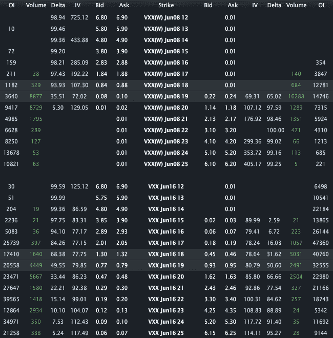

<!--yml

分类：未分类

日期：2024-05-18 16:28:41

-->

# VIX and More: A Favorite Trade: VXX Weeklys

> 来源：[`vixandmore.blogspot.com/2012/06/favorite-trade-vxx-weeklys.html#0001-01-01`](http://vixandmore.blogspot.com/2012/06/favorite-trade-vxx-weeklys.html#0001-01-01)

我不妨坦白说：[周度期权](http://vixandmore.blogspot.com/search/label/weeklys)是多年来我最喜欢的创新之一，而[VXX](http://vixandmore.blogspot.com/search/label/VXX)周度期权已成为过去几个月我最喜欢的交易之一。

为什么？有几个因素在起作用。高[隐含波动率](http://vixandmore.blogspot.com/search/label/implied%20volatility)是一个优点，流动性增长、运用 VXX 进行投机和/或[对冲目的](http://vixandmore.blogspot.com/search/label/hedging)的能力，以及[VIX-based ETPs](http://vixandmore.blogspot.com/search/label/VIX%20ETN)作为新闻周期交易工具的适用性。

下图表展示了今日到期的 VXX 周度期权，并将其与还有整整一周才到期的标准月度期权到期周期内的期权进行了比较。请注意，在今日交易时段还剩下三个小时时，随着到期日的临近，VXX 期权的隐含波动率（以及[偏度](http://vixandmore.blogspot.com/search/label/skew)）被扭曲。下周到期的期权隐含波动率读数在 77 – 125 的范围内，而今日的周度期权在看涨期权方面的隐含波动率超过 700，在看跌期权方面超过 400。虽然这看起来可能很疯狂，鉴于 VIX 可能会毫无预警地急剧波动，以及[VIX 期货](http://vixandmore.blogspot.com/search/label/VIX%20futures)和 VXX 将与现金/现货 VIX 同步大幅波动，期权价格（以及因此隐含波动率）必须考虑到波动的可能性——尤其是在最近新闻周期的背景下。

如果你认为 VXX 的隐含波动率和期权价格很疯狂，那么也许是时候考虑交易 VXX 周度期权了。

重申一下，对于那些关注 VIX 和期权市场的每个人来说，VXX 期权是*极其*激进的交易，并且可能最适合作为价差或其他定义风险位置进行交易，而不是那些使交易者面临无限风险的位置。

未来几周内将更多关于此主题（这些主题）的文章。

相关文章：

**

**来源(s): LivevolPro.com**

***披露(s):*** *Livevol 是 VIX and More 的广告商*
